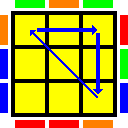

# Rubik's Cube Cheat Sheet

------------------------------------------------------------------------

# Table of Contents

* Fundamentals
  * Notation
  * Terminology
    * Top face
  * Colors
    * Standard Rubik Colors
    * Custom Rubik Colorss
* CFOP
* F2L
 * Beginner F2L Part 1 - RUF to RDF 
 * Beginner F2L Part 2 - RU to RF/RB
   * Beginner F2L Part 2a - RU to RF
   * Beginner F2L Part 2b - RU to RB
* OLL
* PLL

========================================================================


# Fundamentals

## Notation

  * (Non-Java) http://www.cubewhiz.com/notationnj.php

| Face  |Sym|
|:------|:-:|
| Front | F |
| Back  | B |
| Left  | L |
| Right | R |
| Up    | U |
| Down  | D |

## Terminology

### Top face

```
    Corners             Edges

      ___ ___ ___         ___ ___ ___
     |   |   |   |       |   |   |   |
     |LUB|   |RUB|       |   |UB |   |
     |___|___|___|       |___|___|___|
     |   |   |   |       |   |   |   |
     |   |   |   |       |LU |   | RU|
     |___|___|___|       |___|___|___|
     |   |   |   |       |   |   |   |
     |LUF|   |RUF|       |   |UF |   |
     |___|___|___|       |___|___|___|
```

## Colors

### Standard Rubik Colors

  * (Non-Java) http://www.cubewhiz.com/notationnj.php

| Face  |Sym| Color  |
|:------|:-:|:-------|
| Front | F | Red    |
| Back  | B | Orange |
| Left  | L | Blue   |
| Right | R | Green  |
| Up    | U | Yellow |
| Down  | D | White  |

  * Bob Burton Orientation (Red on bottom of page)
  * Solve My Cube - http://solvemycube.com/
  * https://ruwix.com/the-rubiks-cube/notation/advanced/ (Green is Front!)

```
    Before              After

       ?   ?   ?           O   O   O   
      ___ ___ ___         ___ ___ ___  
     |   |   |   |       |   |   |   | 
    ?| ? | ? | ? |?     B| Y | Y | Y |G
     |___|___|___|       |___|___|___| 
     |   |   |   |       |   |   |   | 
    ?| ? | ? | ? |?     B| Y | Y | Y |G
     |___|___|___|       |___|___|___| 
     |   |   |   |       |   |   |   | 
    ?| ? | ? | ? |?     B| Y | Y | Y |G
     |___|___|___|       |___|___|___| 
       ?   ?   ?           R   R   R   
```

### Custom Rubik Colors

| Face  |Sym| Color  |ASCII|
|:------|:-:|:-------|:----|
| Front | F | Silver | `:` |
| Right | R | Red    | `/` |
| Back  | G | Green  | `|` |
| Left  | B | Blue   | `\` |
| Up    | U | White  | `=` |
| Down  | D | Black  | `X` |

```
    Before              After

       ?   ?   ?           G   G   G   
      ___ ___ ___         ___ ___ ___  
     |   |   |   |       |   |   |   | 
    ?| ? | ? | ? |?     B| W | W | W |R
     |___|___|___|       |___|___|___| 
     |   |   |   |       |   |   |   | 
    ?| ? | ? | ? |?     B| W | W | W |R
     |___|___|___|       |___|___|___| 
     |   |   |   |       |   |   |   | 
    ?| ? | ? | ? |?     B| W | W | W |R
     |___|___|___|       |___|___|___| 
       ?   ?   ?           S   S   S   
```

------------------------------------------------------------------------

# CFOP

  * Top = Cross       =  8 moves
  * Mid = First   F2L = 42 http://www.cubewhiz.com/f2l.php
  * Bot   Permute PLL = 21 http://www.cubewhiz.com/pll.php
  * Bot   Orient  OLL = 57 http://www.cubewhiz.com/oll.php

## Recognizing

  * Bot   Permute PLL = 21 http://www.cubewhiz.com/pllrecognition.php
  * Bot   Orient  OLL = 57 http://www.cubewhiz.com/ollrecognition.php

## Printable

  * F2L http://www.cubewhiz.com/f2lprint.pdf
  * PLL http://www.cubewhiz.com/pllprint.pdf
  * OLL http://www.cubewhiz.com/ollprint.pdf

## Why CFOP diagrams suck for beginners

Here is why Bob Burton's [PLL diagrams](http://www.cubewhiz.com/pll.php) suck:

  * Doesn't show me the _before_ and _after_ state (colors)
  * Doesn't explain which coner pieces are moved from/to
  * Doesn't explain which edge  pieces are moved from/to
  * Doesn't explain which corner pieces are rotated in-place
  * Doesn't explain which edge   pieces are rotated in-place
  * Doesn't explain which direction corner pieces are rotated: CW or CCW
  * Doesn't explain which direction edge   pieces are rotated: CW or CCW
  * Crams everything onto one line cluttering it with parenthesis,
    instead of listing groups one per line

========================================================================

# Beginner F2L Part 1 - RUF to RDF

Summary:

  * Corner: Move `RUF` to `RDF`

Note: Top is facing down

When `white` is facing Right, Front, or Up:

|Facing| Axis | Moves                |
|:----:|:----:|:---------------------|
| R    | +X   | `R  U  R'          ` |
| F    | +Z   | `F' U  F           ` | 
| U    | +Y   | `R  U2 R' U' R U R'` |

* https://youtu.be/609nhVzg-5Q?t=543
* https://youtu.be/k-xbcAMfWwM?t=128

------------------------------------------------------------------------

## Beginner F2L - Part 2 - RU to RF/RB

Old-school: 

 |Position |Moves             |
 |:--------|:-----------------|
 |LD to FR | R' D R D F D' F' |

Notes:

 * Top is facing up
 * I learnt this back in the 80's


New-school:

* Middle RU to RF or RB (Top facing down)

|Position    |Moves                       |
|:--------|:------------------------------|
|RU to RF | R' U' R' U' R' U  R  U  R  U  |
|RU to RB | R  U  R  U  R  U' R' U' R' U' |

Notes:

  * Top is facing down

References:

* 12:00 https://youtu.be/609nhVzg-5Q?t=720

------------------------------------------------------------------------

### Beginner F2L Part 2a - RU to RF

Summary:

  * Edge move cycle: UB -> RU -> RF

```
    Before              After

          /\                  /\      
         /  \                /  \     
        /\  /\G             /\  /\O   
       /  \/ Y\            /  \/ Y\   
      /\  /\  /\          /\  /\  /\  
     /  \/  \/  \        /  \/  \/  \ 
    |\  /\y /\  /|      |\  /\y /\  /|
    | \/  \/  \/ |      | \/  \/  \/ |
    | |\  /\ R/| |      | |\  /\ Y/| |
    |\| \/  \/G|/|      |\| \/  \/G|/|
    | + |\  /| + |      | + |\  /| + |
    | |\| \/ |/| |      | |\| \/ |/| |
    |\| + ][ + |/|      |\| + ][ + |/|
    | +r|\][/|g+ |      | +r|\][/|g+ |
    | |\|Y][O|/| |      | |\|R][G|/| |
     \| + ][ + |/        \| + ][ + |/ 
      | |\][/| /          | |\][/| /  
       \| ][ |/            \| ][ |/   
        | ][ /              | ][ /    
         \][/                \][/     
          \/                  \/      
```

  Moves:

    R'
    U' R' U' R'
    U  R  U  R
    U

------------------------------------------------------------------------

### Beginner F2L Part 2b - RU to RF

Summary:

  * Edge move cycle: UB -> RU -> RF

```
    Before              After

          /\                  /\      
         /  \                /  \     
        /\  /\              /\  /\    
       /  \/  \            /  \/  \   
      /\  /\  /\          /\  /\  /\  
     /  \/  \/  \        /  \/  \/  \ 
    |\  /\  /\  /|      |\  /\  /\  /|
    | \/  \/  \/ |      | \/  \/  \/ |
    | |\Y /\ O/| |      | |\Y /\ Y/| |
    |\|G\/  \/G|/|      |\|R\/  \/G|/|
    | + |\  /| +R|Y     | + |\  /| +G|O
    | |\| \/ |/| |      | |\| \/ |/| |
    |\| + ][ + |/|      |\| + ][ + |/|
    | + |\][/| + |      | + |\][/| + |
    | |\| ][ |/| |      | |\| ][ |/| |
     \| + ][ + |/        \| + ][ + |/ 
      | |\][/| /          | |\][/| /  
       \| ][ |/            \| ][ |/   
        | ][ /              | ][ /    
         \][/                \][/     
          \/                  \/
```

  Moves:

    R
    U  R  U  R
    U' R' U' R'
    U'


```
========================================================================
```

# OLL

------------------------------------------------------------------------

## OLL 28 "(Downright Arrow)"

  * http://www.cubewhiz.com/images/oll/oll28.gif

Summary:

  * Corners: n/a
  * Edges: Move cycle: LU -> UB -> RU
  * Edges flipped: LU, UB

    Corners             Edges

      ___ ___ ___        ___ ___ ___
     |   |   |   |      |   |   |   |
     |   |   |   |      |   |>2\|   |
     |___|___|___|      |___/___\___|
     |   |   |   |      |  /|   |\  |
     |   |   |   |      |1<------ >3|
     |___|___|___|      |___|___|___|
     |   |   |   |      |   |   |   |
     |   |   |   |      |   |   |   |
     |___|___|___|      |___|___|___|

    Before              After

       O  =Y=  O           O   O   O   
      ___ ___ ___         ___ ___ ___  
     |===|...|===|       |   |   |   | 
    B|=Y=|.G.|=Y=|G     B| Y | Y | Y |G
     |===|...|===|       |___|___|___| 
    =|...|===|===|       |   |   |   | 
    Y|.O.|=Y=|=Y=|B     B| Y | Y | Y |G
    =|...|===|===|       |___|___|___| 
     |===|===|===|       |   |   |   | 
    B|=Y=|=Y=|=Y=|G     B| Y | Y | Y |G
     |===|===|===|       |___|___|___| 
       R   R   R           R   R   R   

  Moves:

    M' U M
    U2
    M' U M

  1-Liner: (M' U M) U2 (M' U M)

  Alt.:
    R' L F R L'
    U2
    R' L F R L'

  Auto-Solver:

     R  L
     F  U2 F
     R  L
     U2 L2 F2
     R2 D2 F2
     U  L2 B2 R2 F2 D' L2

  Notes:

  * M  = (CCW) same direction as L (Left Thumb)
  * M' = (CW)  same direction as R (Left Ring Finger)
  * M  equivalent to R  L' (replace next U as B)
  * M' equivalent to R' L  (replace next U as F)

------------------------------------------------------------------------

## OLL 57 "(H)"

  * http://www.cubewhiz.com/images/oll/oll57.gif

Summary:

  * Corners: n/a
  * Edges: UB -> UF -> RU
  * Edges flipped: UB, UF

```
    Corners             Edges

      ___ ___ ___        ___ ___ ___
     |   |   |   |      |   |   |   |
     |   |   |   |      |   | 1 |   |
     |___|___|___|      |___|_|<|___|
     |   |   |   |      |   | | \   |
     |   |   |   |      |   | | |>3 |
     |___|___|___|      |___|_|_/___|
     |   |   |   |      |   | v/|   |
     |   |   |   |      |   | 2 |   |
     |___|___|___|      |___|___|___|

    Before              After

       O  =Y=  O           O   O   O   
      ___ ___ ___         ___ ___ ___  
     |===|...|===|       |   |   |   | 
    B|=Y=|.R.|=Y=|G     B| Y | Y | Y |G
     |===|...|===|       |___|___|___| 
     |===|===|===|       |   |   |   | 
    B|=Y=|=Y=|=Y=|O     B| Y | Y | Y |G
     |===|===|===|       |___|___|___| 
     |===|...|===|       |   |   |   | 
    B|=Y=|.G.|=Y=|G     B| Y | Y | Y |G
     |===|...|===|       |___|___|___| 
       R  =Y=  R           R   R   R   
```

  Moves:

    R  U R' U'
    M' U R  U'
    Rw'

  Alt:

    R    U R' U'
    R' L F R  F'
    L

  Notes:

  * M'  = (CW), same direction as R (Left Ring Finger)
  * Rw' = (CCW) R' + M, equivalent to L

  1-Liner BB: (R U R' U') (M' U R U') Rw'

  Auto-Solver:

------------------------------------------------------------------------


========================================================================


# PLL

## PLL: A(a)-perm

Diagrams:

 * 
 * http://www.cubewhiz.com/images/pll/pll01.gif

Description: Move Back "Headlights" to Right

Summary:

 * Corners move cycle: LUB -> RUB -> RUF
 * Corner faces are rotated CW
 * Edges: n/a

```
    Corners             Edges

      ___ ___ ___         ___ ___ ___  
     |   |   |   |       |   |   |   | 
     | 1------>2 |       |   |   |   | 
     |__<\___|_|_|       |___|___|___| 
     |   |\  | | |       |   |   |   | 
     |   | \ | | |       |   |   |   | 
     |___|__\|_|_|       |___|___|___| 
     |   |   \ v |       |   |   |   | 
     |   |   |\3 |       |   |   |   | 
     |___|___|___|       |___|___|___| 


    Before              After

       G   O   G           O   O   O   
      ___ ___ ___         ___ ___ ___  
     |===|   |===|       |   |   |   | 
    O|=Y=| Y |=Y=|R     B| Y | Y | Y |G
     |===|___|===|       |___|___|___| 
     |   |   |   |       |   |   |   |
    B| Y | Y | Y |G     B| Y | Y | Y |G
     |___|___|___|       |___|___|___| 
     |   |   |===|       |   |   |   | 
    B| Y | Y |=Y=|B     B| Y | Y | Y |G
     |___|___|===|       |___|___|___| 
       R   R   O           R   R   R   

     G G    O O
    OyyyR  ByyyG
     yyy    yyy
     yyyB   yyyG
       O      R

      /R/  G  /R/         |G|  G  |G|
      ___ ___ ___         ___ ___ ___  
    ||   |   |   |:     \|===|   |===| 
    G| w | w | w |S     B|=w=| w |=w=|R
    ||___|___|___|:     \|===|___|===| 
     |   |   |   |       |   |   |   |
    B| w | w | w |R     B| w | w | w |R
     |___|___|___|       |___|___|___| 
     |   |   |   |\      |   |   |===| 
    B| w | w | w |B     B| w | w |=w=|R
     |___|___|___|\      |___|___|===| 
       S   S  |G|          S   S  :S:  
```

  Moves:

    R' F  R' B2
    R  F' R' B2
    R2

  Alt:

    x'
    R2 D2
    R' U'
    D2
    R' U  R'

  Bob Burton: PLL Aa

    x
    R' U  R'
    D2
    R  U' R'
    D2 R2

  Video:

  * https://www.youtube.com/watch?annotation_id=annotation_353125&feature=iv&src_vid=BpocGD23o4Y&v=ssjrFCGEZKU

  Also see: Bob Burton "Fish" #10
    (R U R' U) (R' F R F') (R U2 R')

------------------------------------------------------------------------


========================================================================
