OLL stage is done when cube reaches state:

    #  102/1296 @  118384 $ 000:01110:01110:01110:000 CP:0 EP:0

OLL permtuations sorted by #
```
    $ node enum_oll.js -c -i -n -p
```

All OLL states:

|# i'th/n'th| @ ID    | $ Bit String              |CP |EP | Image |
|----------:|--------:|:--------------------------|:-:|:-:|:------|
|    1/1296 |  109831 | 000:01101:01101:00000:111 | 2 | 2 |  |
|    2/1296 |  109838 | 000:01101:01101:00001:110 | 1 | 1 |  |
|    3/1296 |  109846 | 000:01101:01101:00010:110 | 0 | 0 |  |
|    4/1296 |  109861 | 000:01101:01101:00100:101 | 2 | 2 |  |
|    5/1296 |  109868 | 000:01101:01101:00101:100 | 1 | 1 |  |
|    6/1296 |  109876 | 000:01101:01101:00110:100 | 0 | 0 |  |
|    7/1296 |  109891 | 000:01101:01101:01000:011 | 1 | 1 |  |
|    8/1296 |  109898 | 000:01101:01101:01001:010 | 0 | 0 |  |
|    9/1296 |  109906 | 000:01101:01101:01010:010 | 2 | 2 |  |
|   10/1296 |  109921 | 000:01101:01101:01100:001 | 1 | 1 |  |
|   11/1296 |  109928 | 000:01101:01101:01101:000 | 0 | 0 |  |
|   12/1296 |  109936 | 000:01101:01101:01110:000 | 2 | 2 |  |
|   13/1296 |  109955 | 000:01101:01101:10000:011 | 0 | 0 |  |
|   14/1296 |  109962 | 000:01101:01101:10001:010 | 2 | 2 |  |
|   15/1296 |  109970 | 000:01101:01101:10010:010 | 1 | 1 |  |
|   16/1296 |  109985 | 000:01101:01101:10100:001 | 0 | 0 |  |
|   17/1296 |  109992 | 000:01101:01101:10101:000 | 2 | 2 |  |
|   18/1296 |  110000 | 000:01101:01101:10110:000 | 1 | 1 |  |
|   19/1296 |  110087 | 000:01101:01110:00000:111 | 2 | 2 |  |
|   20/1296 |  110094 | 000:01101:01110:00001:110 | 1 | 1 |  |
|   21/1296 |  110102 | 000:01101:01110:00010:110 | 0 | 0 |  |
|   22/1296 |  110117 | 000:01101:01110:00100:101 | 2 | 2 |  |
|   23/1296 |  110124 | 000:01101:01110:00101:100 | 1 | 1 |  |
|   24/1296 |  110132 | 000:01101:01110:00110:100 | 0 | 0 |  |
|   25/1296 |  110147 | 000:01101:01110:01000:011 | 1 | 1 |  |
|   26/1296 |  110154 | 000:01101:01110:01001:010 | 0 | 0 | 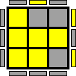 |
|   27/1296 |  110162 | 000:01101:01110:01010:010 | 2 | 2 |  |
|   28/1296 |  110177 | 000:01101:01110:01100:001 | 1 | 1 |  |
|   29/1296 |  110184 | 000:01101:01110:01101:000 | 0 | 0 |  |
|   30/1296 |  110192 | 000:01101:01110:01110:000 | 2 | 2 |  |
|   31/1296 |  110211 | 000:01101:01110:10000:011 | 0 | 0 |  |
|   32/1296 |  110218 | 000:01101:01110:10001:010 | 2 | 2 |  |
|   33/1296 |  110226 | 000:01101:01110:10010:010 | 1 | 1 |  |
|   34/1296 |  110241 | 000:01101:01110:10100:001 | 0 | 0 |  |
|   35/1296 |  110248 | 000:01101:01110:10101:000 | 2 | 2 |  |
|   36/1296 |  110256 | 000:01101:01110:10110:000 | 1 | 1 |  |
|   37/1296 |  111879 | 000:01101:10101:00000:111 | 2 | 2 |  |
|   38/1296 |  111886 | 000:01101:10101:00001:110 | 1 | 1 |  |
|   39/1296 |  111894 | 000:01101:10101:00010:110 | 0 | 0 |  |
|   40/1296 |  111909 | 000:01101:10101:00100:101 | 2 | 2 |  |
|   41/1296 |  111916 | 000:01101:10101:00101:100 | 1 | 1 |  |
|   42/1296 |  111924 | 000:01101:10101:00110:100 | 0 | 0 |  |
|   43/1296 |  111939 | 000:01101:10101:01000:011 | 1 | 1 |  |
|   44/1296 |  111946 | 000:01101:10101:01001:010 | 0 | 0 |  |
|   45/1296 |  111954 | 000:01101:10101:01010:010 | 2 | 2 |  |
|   46/1296 |  111969 | 000:01101:10101:01100:001 | 1 | 1 |  |
|   47/1296 |  111976 | 000:01101:10101:01101:000 | 0 | 0 |  |
|   48/1296 |  111984 | 000:01101:10101:01110:000 | 2 | 2 |  |
|   49/1296 |  112003 | 000:01101:10101:10000:011 | 0 | 0 |  |
|   50/1296 |  112010 | 000:01101:10101:10001:010 | 2 | 2 |  |
|   51/1296 |  112018 | 000:01101:10101:10010:010 | 1 | 1 |  |
|   52/1296 |  112033 | 000:01101:10101:10100:001 | 0 | 0 |  |
|   53/1296 |  112040 | 000:01101:10101:10101:000 | 2 | 2 |  |
|   54/1296 |  112048 | 000:01101:10101:10110:000 | 1 | 1 |  |
|   55/1296 |  112135 | 000:01101:10110:00000:111 | 2 | 2 |  |
|   56/1296 |  112142 | 000:01101:10110:00001:110 | 1 | 1 |  |
|   57/1296 |  112150 | 000:01101:10110:00010:110 | 0 | 0 |  |
|   58/1296 |  112165 | 000:01101:10110:00100:101 | 2 | 2 |  |
|   59/1296 |  112172 | 000:01101:10110:00101:100 | 1 | 1 |  |
|   60/1296 |  112180 | 000:01101:10110:00110:100 | 0 | 0 |  |
|   61/1296 |  112195 | 000:01101:10110:01000:011 | 1 | 1 |  |
|   62/1296 |  112202 | 000:01101:10110:01001:010 | 0 | 0 |  |
|   63/1296 |  112210 | 000:01101:10110:01010:010 | 2 | 2 |  |
|   64/1296 |  112225 | 000:01101:10110:01100:001 | 1 | 1 |  |
|   65/1296 |  112232 | 000:01101:10110:01101:000 | 0 | 0 |  |
|   66/1296 |  112240 | 000:01101:10110:01110:000 | 2 | 2 |  |
|   67/1296 |  112259 | 000:01101:10110:10000:011 | 0 | 0 |  |
|   68/1296 |  112266 | 000:01101:10110:10001:010 | 2 | 2 |  |
|   69/1296 |  112274 | 000:01101:10110:10010:010 | 1 | 1 |  |
|   70/1296 |  112289 | 000:01101:10110:10100:001 | 0 | 0 |  |
|   71/1296 |  112296 | 000:01101:10110:10101:000 | 2 | 2 |  |
|   72/1296 |  112304 | 000:01101:10110:10110:000 | 1 | 1 |  |
|   73/1296 |  118023 | 000:01110:01101:00000:111 | 0 | 0 |  |
|   74/1296 |  118030 | 000:01110:01101:00001:110 | 2 | 2 |  |
|   75/1296 |  118038 | 000:01110:01101:00010:110 | 1 | 1 |  |
|   76/1296 |  118053 | 000:01110:01101:00100:101 | 0 | 0 |  |
|   77/1296 |  118060 | 000:01110:01101:00101:100 | 2 | 2 |  |
|   78/1296 |  118068 | 000:01110:01101:00110:100 | 1 | 1 |  |
|   79/1296 |  118083 | 000:01110:01101:01000:011 | 2 | 2 |  |
|   80/1296 |  118090 | 000:01110:01101:01001:010 | 1 | 1 |  |
|   81/1296 |  118098 | 000:01110:01101:01010:010 | 0 | 0 |  |
|   82/1296 |  118113 | 000:01110:01101:01100:001 | 2 | 2 |  |
|   83/1296 |  118120 | 000:01110:01101:01101:000 | 1 | 1 |  |
|   84/1296 |  118128 | 000:01110:01101:01110:000 | 0 | 0 |  |
|   85/1296 |  118147 | 000:01110:01101:10000:011 | 1 | 1 |  |
|   86/1296 |  118154 | 000:01110:01101:10001:010 | 0 | 0 |  |
|   87/1296 |  118162 | 000:01110:01101:10010:010 | 2 | 2 |  |
|   88/1296 |  118177 | 000:01110:01101:10100:001 | 1 | 1 |  |
|   89/1296 |  118184 | 000:01110:01101:10101:000 | 0 | 0 |  |
|   90/1296 |  118192 | 000:01110:01101:10110:000 | 2 | 2 |  |
|   91/1296 |  118279 | 000:01110:01110:00000:111 | 0 | 0 |  |
|   92/1296 |  118286 | 000:01110:01110:00001:110 | 2 | 2 |  |
|   93/1296 |  118294 | 000:01110:01110:00010:110 | 1 | 1 |  |
|   94/1296 |  118309 | 000:01110:01110:00100:101 | 0 | 0 |  |
|   95/1296 |  118316 | 000:01110:01110:00101:100 | 2 | 2 | 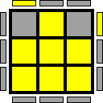 |
|   96/1296 |  118324 | 000:01110:01110:00110:100 | 1 | 1 |  |
|   97/1296 |  118339 | 000:01110:01110:01000:011 | 2 | 2 |  |
|   98/1296 |  118346 | 000:01110:01110:01001:010 | 1 | 1 |  |
|   99/1296 |  118354 | 000:01110:01110:01010:010 | 0 | 0 |  |
|  100/1296 |  118369 | 000:01110:01110:01100:001 | 2 | 2 |  |
|  101/1296 |  118376 | 000:01110:01110:01101:000 | 1 | 1 |  |
|  102/1296 |  118384 | 000:01110:01110:01110:000 | 0 | 0 |  |
|  103/1296 |  118403 | 000:01110:01110:10000:011 | 1 | 1 |  |
|  104/1296 |  118410 | 000:01110:01110:10001:010 | 0 | 0 |  |
|  105/1296 |  118418 | 000:01110:01110:10010:010 | 2 | 2 |  |
|  106/1296 |  118433 | 000:01110:01110:10100:001 | 1 | 1 |  |
|  107/1296 |  118440 | 000:01110:01110:10101:000 | 0 | 0 |  |
|  108/1296 |  118448 | 000:01110:01110:10110:000 | 2 | 2 |  |
|  109/1296 |  120071 | 000:01110:10101:00000:111 | 0 | 0 |  |
|  110/1296 |  120078 | 000:01110:10101:00001:110 | 2 | 2 |  |
|  111/1296 |  120086 | 000:01110:10101:00010:110 | 1 | 1 |  |
|  112/1296 |  120101 | 000:01110:10101:00100:101 | 0 | 0 |  |
|  113/1296 |  120108 | 000:01110:10101:00101:100 | 2 | 2 |  |
|  114/1296 |  120116 | 000:01110:10101:00110:100 | 1 | 1 |  |
|  115/1296 |  120131 | 000:01110:10101:01000:011 | 2 | 2 |  |
|  116/1296 |  120138 | 000:01110:10101:01001:010 | 1 | 1 |  |
|  117/1296 |  120146 | 000:01110:10101:01010:010 | 0 | 0 |  |
|  118/1296 |  120161 | 000:01110:10101:01100:001 | 2 | 2 |  |
|  119/1296 |  120168 | 000:01110:10101:01101:000 | 1 | 1 |  |
|  120/1296 |  120176 | 000:01110:10101:01110:000 | 0 | 0 |  |
|  121/1296 |  120195 | 000:01110:10101:10000:011 | 1 | 1 |  |
|  122/1296 |  120202 | 000:01110:10101:10001:010 | 0 | 0 |  |
|  123/1296 |  120210 | 000:01110:10101:10010:010 | 2 | 2 |  |
|  124/1296 |  120225 | 000:01110:10101:10100:001 | 1 | 1 |  |
|  125/1296 |  120232 | 000:01110:10101:10101:000 | 0 | 0 |  |
|  126/1296 |  120240 | 000:01110:10101:10110:000 | 2 | 2 |  |
|  127/1296 |  120327 | 000:01110:10110:00000:111 | 0 | 0 |  |
|  128/1296 |  120334 | 000:01110:10110:00001:110 | 2 | 2 |  |
|  129/1296 |  120342 | 000:01110:10110:00010:110 | 1 | 1 |  |
|  130/1296 |  120357 | 000:01110:10110:00100:101 | 0 | 0 |  |
|  131/1296 |  120364 | 000:01110:10110:00101:100 | 2 | 2 |  |
|  132/1296 |  120372 | 000:01110:10110:00110:100 | 1 | 1 |  |
|  133/1296 |  120387 | 000:01110:10110:01000:011 | 2 | 2 |  |
|  134/1296 |  120394 | 000:01110:10110:01001:010 | 1 | 1 |  |
|  135/1296 |  120402 | 000:01110:10110:01010:010 | 0 | 0 |  |
|  136/1296 |  120417 | 000:01110:10110:01100:001 | 2 | 2 |  |
|  137/1296 |  120424 | 000:01110:10110:01101:000 | 1 | 1 |  |
|  138/1296 |  120432 | 000:01110:10110:01110:000 | 0 | 0 |  |
|  139/1296 |  120451 | 000:01110:10110:10000:011 | 1 | 1 |  |
|  140/1296 |  120458 | 000:01110:10110:10001:010 | 0 | 0 | 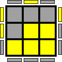 |
|  141/1296 |  120466 | 000:01110:10110:10010:010 | 2 | 2 |  |
|  142/1296 |  120481 | 000:01110:10110:10100:001 | 1 | 1 |  |
|  143/1296 |  120488 | 000:01110:10110:10101:000 | 0 | 0 |  |
|  144/1296 |  120496 | 000:01110:10110:10110:000 | 2 | 2 |  |
|  145/1296 |  175367 | 000:10101:01101:00000:111 | 0 | 0 |  |
|  146/1296 |  175374 | 000:10101:01101:00001:110 | 2 | 2 |  |
|  147/1296 |  175382 | 000:10101:01101:00010:110 | 1 | 1 |  |
|  148/1296 |  175397 | 000:10101:01101:00100:101 | 0 | 0 |  |
|  149/1296 |  175404 | 000:10101:01101:00101:100 | 2 | 2 |  |
|  150/1296 |  175412 | 000:10101:01101:00110:100 | 1 | 1 |  |
|  151/1296 |  175427 | 000:10101:01101:01000:011 | 2 | 2 |  |
|  152/1296 |  175434 | 000:10101:01101:01001:010 | 1 | 1 |  |
|  153/1296 |  175442 | 000:10101:01101:01010:010 | 0 | 0 |  |
|  154/1296 |  175457 | 000:10101:01101:01100:001 | 2 | 2 |  |
|  155/1296 |  175464 | 000:10101:01101:01101:000 | 1 | 1 |  |
|  156/1296 |  175472 | 000:10101:01101:01110:000 | 0 | 0 |  |
|  157/1296 |  175491 | 000:10101:01101:10000:011 | 1 | 1 |  |
|  158/1296 |  175498 | 000:10101:01101:10001:010 | 0 | 0 |  |
|  159/1296 |  175506 | 000:10101:01101:10010:010 | 2 | 2 |  |
|  160/1296 |  175521 | 000:10101:01101:10100:001 | 1 | 1 |  |
|  161/1296 |  175528 | 000:10101:01101:10101:000 | 0 | 0 |  |
|  162/1296 |  175536 | 000:10101:01101:10110:000 | 2 | 2 |  |
|  163/1296 |  175623 | 000:10101:01110:00000:111 | 0 | 0 |  |
|  164/1296 |  175630 | 000:10101:01110:00001:110 | 2 | 2 |  |
|  165/1296 |  175638 | 000:10101:01110:00010:110 | 1 | 1 |  |
|  166/1296 |  175653 | 000:10101:01110:00100:101 | 0 | 0 |  |
|  167/1296 |  175660 | 000:10101:01110:00101:100 | 2 | 2 |  |
|  168/1296 |  175668 | 000:10101:01110:00110:100 | 1 | 1 |  |
|  169/1296 |  175683 | 000:10101:01110:01000:011 | 2 | 2 |  |
|  170/1296 |  175690 | 000:10101:01110:01001:010 | 1 | 1 |  |
|  171/1296 |  175698 | 000:10101:01110:01010:010 | 0 | 0 |  |
|  172/1296 |  175713 | 000:10101:01110:01100:001 | 2 | 2 |  |
|  173/1296 |  175720 | 000:10101:01110:01101:000 | 1 | 1 |  |
|  174/1296 |  175728 | 000:10101:01110:01110:000 | 0 | 0 |  |
|  175/1296 |  175747 | 000:10101:01110:10000:011 | 1 | 1 |  |
|  176/1296 |  175754 | 000:10101:01110:10001:010 | 0 | 0 |  |
|  177/1296 |  175762 | 000:10101:01110:10010:010 | 2 | 2 |  |
|  178/1296 |  175777 | 000:10101:01110:10100:001 | 1 | 1 |  |
|  179/1296 |  175784 | 000:10101:01110:10101:000 | 0 | 0 |  |
|  180/1296 |  175792 | 000:10101:01110:10110:000 | 2 | 2 |  |
|  181/1296 |  177415 | 000:10101:10101:00000:111 | 0 | 0 |  |
|  182/1296 |  177422 | 000:10101:10101:00001:110 | 2 | 2 |  |
|  183/1296 |  177430 | 000:10101:10101:00010:110 | 1 | 1 |  |
|  184/1296 |  177445 | 000:10101:10101:00100:101 | 0 | 0 |  |
|  185/1296 |  177452 | 000:10101:10101:00101:100 | 2 | 2 |  |
|  186/1296 |  177460 | 000:10101:10101:00110:100 | 1 | 1 |  |
|  187/1296 |  177475 | 000:10101:10101:01000:011 | 2 | 2 |  |
|  188/1296 |  177482 | 000:10101:10101:01001:010 | 1 | 1 |  |
|  189/1296 |  177490 | 000:10101:10101:01010:010 | 0 | 0 |  |
|  190/1296 |  177505 | 000:10101:10101:01100:001 | 2 | 2 |  |
|  191/1296 |  177512 | 000:10101:10101:01101:000 | 1 | 1 |  |
|  192/1296 |  177520 | 000:10101:10101:01110:000 | 0 | 0 |  |
|  193/1296 |  177539 | 000:10101:10101:10000:011 | 1 | 1 |  |
|  194/1296 |  177546 | 000:10101:10101:10001:010 | 0 | 0 |  |
|  195/1296 |  177554 | 000:10101:10101:10010:010 | 2 | 2 |  |
|  196/1296 |  177569 | 000:10101:10101:10100:001 | 1 | 1 |  |
|  197/1296 |  177576 | 000:10101:10101:10101:000 | 0 | 0 |  |
|  198/1296 |  177584 | 000:10101:10101:10110:000 | 2 | 2 |  |
|  199/1296 |  177671 | 000:10101:10110:00000:111 | 0 | 0 |  |
|  200/1296 |  177678 | 000:10101:10110:00001:110 | 2 | 2 |  |
|  201/1296 |  177686 | 000:10101:10110:00010:110 | 1 | 1 |  |
|  202/1296 |  177701 | 000:10101:10110:00100:101 | 0 | 0 |  |
|  203/1296 |  177708 | 000:10101:10110:00101:100 | 2 | 2 |  |
|  204/1296 |  177716 | 000:10101:10110:00110:100 | 1 | 1 |  |
|  205/1296 |  177731 | 000:10101:10110:01000:011 | 2 | 2 |  |
|  206/1296 |  177738 | 000:10101:10110:01001:010 | 1 | 1 |  |
|  207/1296 |  177746 | 000:10101:10110:01010:010 | 0 | 0 |  |
|  208/1296 |  177761 | 000:10101:10110:01100:001 | 2 | 2 |  |
|  209/1296 |  177768 | 000:10101:10110:01101:000 | 1 | 1 |  |
|  210/1296 |  177776 | 000:10101:10110:01110:000 | 0 | 0 |  |
|  211/1296 |  177795 | 000:10101:10110:10000:011 | 1 | 1 |  |
|  212/1296 |  177802 | 000:10101:10110:10001:010 | 0 | 0 |  |
|  213/1296 |  177810 | 000:10101:10110:10010:010 | 2 | 2 |  |
|  214/1296 |  177825 | 000:10101:10110:10100:001 | 1 | 1 |  |
|  215/1296 |  177832 | 000:10101:10110:10101:000 | 0 | 0 |  |
|  216/1296 |  177840 | 000:10101:10110:10110:000 | 2 | 2 |  |
|  217/1296 |  183559 | 000:10110:01101:00000:111 | 1 | 1 |  |
|  218/1296 |  183566 | 000:10110:01101:00001:110 | 0 | 0 |  |
|  219/1296 |  183574 | 000:10110:01101:00010:110 | 2 | 2 |  |
|  220/1296 |  183589 | 000:10110:01101:00100:101 | 1 | 1 |  |
|  221/1296 |  183596 | 000:10110:01101:00101:100 | 0 | 0 |  |
|  222/1296 |  183604 | 000:10110:01101:00110:100 | 2 | 2 |  |
|  223/1296 |  183619 | 000:10110:01101:01000:011 | 0 | 0 |  |
|  224/1296 |  183626 | 000:10110:01101:01001:010 | 2 | 2 | 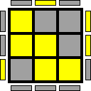 |
|  225/1296 |  183634 | 000:10110:01101:01010:010 | 1 | 1 |  |
|  226/1296 |  183649 | 000:10110:01101:01100:001 | 0 | 0 |  |
|  227/1296 |  183656 | 000:10110:01101:01101:000 | 2 | 2 |  |
|  228/1296 |  183664 | 000:10110:01101:01110:000 | 1 | 1 |  |
|  229/1296 |  183683 | 000:10110:01101:10000:011 | 2 | 2 |  |
|  230/1296 |  183690 | 000:10110:01101:10001:010 | 1 | 1 |  |
|  231/1296 |  183698 | 000:10110:01101:10010:010 | 0 | 0 |  |
|  232/1296 |  183713 | 000:10110:01101:10100:001 | 2 | 2 |  |
|  233/1296 |  183720 | 000:10110:01101:10101:000 | 1 | 1 |  |
|  234/1296 |  183728 | 000:10110:01101:10110:000 | 0 | 0 |  |
|  235/1296 |  183815 | 000:10110:01110:00000:111 | 1 | 1 |  |
|  236/1296 |  183822 | 000:10110:01110:00001:110 | 0 | 0 |  |
|  237/1296 |  183830 | 000:10110:01110:00010:110 | 2 | 2 |  |
|  238/1296 |  183845 | 000:10110:01110:00100:101 | 1 | 1 |  |
|  239/1296 |  183852 | 000:10110:01110:00101:100 | 0 | 0 |  |
|  240/1296 |  183860 | 000:10110:01110:00110:100 | 2 | 2 |  |
|  241/1296 |  183875 | 000:10110:01110:01000:011 | 0 | 0 |  |
|  242/1296 |  183882 | 000:10110:01110:01001:010 | 2 | 2 |  |
|  243/1296 |  183890 | 000:10110:01110:01010:010 | 1 | 1 |  |
|  244/1296 |  183905 | 000:10110:01110:01100:001 | 0 | 0 |  |
|  245/1296 |  183912 | 000:10110:01110:01101:000 | 2 | 2 |  |
|  246/1296 |  183920 | 000:10110:01110:01110:000 | 1 | 1 |  |
|  247/1296 |  183939 | 000:10110:01110:10000:011 | 2 | 2 |  |
|  248/1296 |  183946 | 000:10110:01110:10001:010 | 1 | 1 |  |
|  249/1296 |  183954 | 000:10110:01110:10010:010 | 0 | 0 |  |
|  250/1296 |  183969 | 000:10110:01110:10100:001 | 2 | 2 |  |
|  251/1296 |  183976 | 000:10110:01110:10101:000 | 1 | 1 |  |
|  252/1296 |  183984 | 000:10110:01110:10110:000 | 0 | 0 |  |
|  253/1296 |  185607 | 000:10110:10101:00000:111 | 1 | 1 |  |
|  254/1296 |  185614 | 000:10110:10101:00001:110 | 0 | 0 |  |
|  255/1296 |  185622 | 000:10110:10101:00010:110 | 2 | 2 |  |
|  256/1296 |  185637 | 000:10110:10101:00100:101 | 1 | 1 |  |
|  257/1296 |  185644 | 000:10110:10101:00101:100 | 0 | 0 |  |
|  258/1296 |  185652 | 000:10110:10101:00110:100 | 2 | 2 |  |
|  259/1296 |  185667 | 000:10110:10101:01000:011 | 0 | 0 |  |
|  260/1296 |  185674 | 000:10110:10101:01001:010 | 2 | 2 |  |
|  261/1296 |  185682 | 000:10110:10101:01010:010 | 1 | 1 |  |
|  262/1296 |  185697 | 000:10110:10101:01100:001 | 0 | 0 |  |
|  263/1296 |  185704 | 000:10110:10101:01101:000 | 2 | 2 |  |
|  264/1296 |  185712 | 000:10110:10101:01110:000 | 1 | 1 |  |
|  265/1296 |  185731 | 000:10110:10101:10000:011 | 2 | 2 |  |
|  266/1296 |  185738 | 000:10110:10101:10001:010 | 1 | 1 |  |
|  267/1296 |  185746 | 000:10110:10101:10010:010 | 0 | 0 |  |
|  268/1296 |  185761 | 000:10110:10101:10100:001 | 2 | 2 |  |
|  269/1296 |  185768 | 000:10110:10101:10101:000 | 1 | 1 |  |
|  270/1296 |  185776 | 000:10110:10101:10110:000 | 0 | 0 |  |
|  271/1296 |  185863 | 000:10110:10110:00000:111 | 1 | 1 |  |
|  272/1296 |  185870 | 000:10110:10110:00001:110 | 0 | 0 |  |
|  273/1296 |  185878 | 000:10110:10110:00010:110 | 2 | 2 |  |
|  274/1296 |  185893 | 000:10110:10110:00100:101 | 1 | 1 |  |
|  275/1296 |  185900 | 000:10110:10110:00101:100 | 0 | 0 |  |
|  276/1296 |  185908 | 000:10110:10110:00110:100 | 2 | 2 |  |
|  277/1296 |  185923 | 000:10110:10110:01000:011 | 0 | 0 |  |
|  278/1296 |  185930 | 000:10110:10110:01001:010 | 2 | 2 |  |
|  279/1296 |  185938 | 000:10110:10110:01010:010 | 1 | 1 |  |
|  280/1296 |  185953 | 000:10110:10110:01100:001 | 0 | 0 |  |
|  281/1296 |  185960 | 000:10110:10110:01101:000 | 2 | 2 |  |
|  282/1296 |  185968 | 000:10110:10110:01110:000 | 1 | 1 |  |
|  283/1296 |  185987 | 000:10110:10110:10000:011 | 2 | 2 |  |
|  284/1296 |  185994 | 000:10110:10110:10001:010 | 1 | 1 |  |
|  285/1296 |  186002 | 000:10110:10110:10010:010 | 0 | 0 |  |
|  286/1296 |  186017 | 000:10110:10110:10100:001 | 2 | 2 |  |
|  287/1296 |  186024 | 000:10110:10110:10101:000 | 1 | 1 |  |
|  288/1296 |  186032 | 000:10110:10110:10110:000 | 0 | 0 |  |
|  289/1296 |  363783 | 001:01100:01101:00000:111 | 1 | 1 |  |
|  290/1296 |  363790 | 001:01100:01101:00001:110 | 0 | 0 |  |
|  291/1296 |  363798 | 001:01100:01101:00010:110 | 2 | 2 |  |
|  292/1296 |  363813 | 001:01100:01101:00100:101 | 1 | 1 |  |
|  293/1296 |  363820 | 001:01100:01101:00101:100 | 0 | 0 |  |
|  294/1296 |  363828 | 001:01100:01101:00110:100 | 2 | 2 |  |
|  295/1296 |  363843 | 001:01100:01101:01000:011 | 0 | 0 |  |
|  296/1296 |  363850 | 001:01100:01101:01001:010 | 2 | 2 |  |
|  297/1296 |  363858 | 001:01100:01101:01010:010 | 1 | 1 |  |
|  298/1296 |  363873 | 001:01100:01101:01100:001 | 0 | 0 |  |
|  299/1296 |  363880 | 001:01100:01101:01101:000 | 2 | 2 |  |
|  300/1296 |  363888 | 001:01100:01101:01110:000 | 1 | 1 |  |
|  301/1296 |  363907 | 001:01100:01101:10000:011 | 2 | 2 |  |
|  302/1296 |  363914 | 001:01100:01101:10001:010 | 1 | 1 |  |
|  303/1296 |  363922 | 001:01100:01101:10010:010 | 0 | 0 |  |
|  304/1296 |  363937 | 001:01100:01101:10100:001 | 2 | 2 |  |
|  305/1296 |  363944 | 001:01100:01101:10101:000 | 1 | 1 |  |
|  306/1296 |  363952 | 001:01100:01101:10110:000 | 0 | 0 |  |
|  307/1296 |  364039 | 001:01100:01110:00000:111 | 1 | 1 |  |
|  308/1296 |  364046 | 001:01100:01110:00001:110 | 0 | 0 |  |
|  309/1296 |  364054 | 001:01100:01110:00010:110 | 2 | 2 |  |
|  310/1296 |  364069 | 001:01100:01110:00100:101 | 1 | 1 |  |
|  311/1296 |  364076 | 001:01100:01110:00101:100 | 0 | 0 |  |
|  312/1296 |  364084 | 001:01100:01110:00110:100 | 2 | 2 |  |
|  313/1296 |  364099 | 001:01100:01110:01000:011 | 0 | 0 |  |
|  314/1296 |  364106 | 001:01100:01110:01001:010 | 2 | 2 |  |
|  315/1296 |  364114 | 001:01100:01110:01010:010 | 1 | 1 |  |
|  316/1296 |  364129 | 001:01100:01110:01100:001 | 0 | 0 |  |
|  317/1296 |  364136 | 001:01100:01110:01101:000 | 2 | 2 |  |
|  318/1296 |  364144 | 001:01100:01110:01110:000 | 1 | 1 |  |
|  319/1296 |  364163 | 001:01100:01110:10000:011 | 2 | 2 |  |
|  320/1296 |  364170 | 001:01100:01110:10001:010 | 1 | 1 |  |
|  321/1296 |  364178 | 001:01100:01110:10010:010 | 0 | 0 |  |
|  322/1296 |  364193 | 001:01100:01110:10100:001 | 2 | 2 |  |
|  323/1296 |  364200 | 001:01100:01110:10101:000 | 1 | 1 |  |
|  324/1296 |  364208 | 001:01100:01110:10110:000 | 0 | 0 |  |
|  325/1296 |  365831 | 001:01100:10101:00000:111 | 1 | 1 |  |
|  326/1296 |  365838 | 001:01100:10101:00001:110 | 0 | 0 |  |
|  327/1296 |  365846 | 001:01100:10101:00010:110 | 2 | 2 |  |
|  328/1296 |  365861 | 001:01100:10101:00100:101 | 1 | 1 |  |
|  329/1296 |  365868 | 001:01100:10101:00101:100 | 0 | 0 |  |
|  330/1296 |  365876 | 001:01100:10101:00110:100 | 2 | 2 |  |
|  331/1296 |  365891 | 001:01100:10101:01000:011 | 0 | 0 |  |
|  332/1296 |  365898 | 001:01100:10101:01001:010 | 2 | 2 |  |
|  333/1296 |  365906 | 001:01100:10101:01010:010 | 1 | 1 |  |
|  334/1296 |  365921 | 001:01100:10101:01100:001 | 0 | 0 |  |
|  335/1296 |  365928 | 001:01100:10101:01101:000 | 2 | 2 |  |
|  336/1296 |  365936 | 001:01100:10101:01110:000 | 1 | 1 |  |
|  337/1296 |  365955 | 001:01100:10101:10000:011 | 2 | 2 |  |
|  338/1296 |  365962 | 001:01100:10101:10001:010 | 1 | 1 |  |
|  339/1296 |  365970 | 001:01100:10101:10010:010 | 0 | 0 |  |
|  340/1296 |  365985 | 001:01100:10101:10100:001 | 2 | 2 |  |
|  341/1296 |  365992 | 001:01100:10101:10101:000 | 1 | 1 |  |
|  342/1296 |  366000 | 001:01100:10101:10110:000 | 0 | 0 |  |
|  343/1296 |  366087 | 001:01100:10110:00000:111 | 1 | 1 |  |
|  344/1296 |  366094 | 001:01100:10110:00001:110 | 0 | 0 |  |
|  345/1296 |  366102 | 001:01100:10110:00010:110 | 2 | 2 |  |
|  346/1296 |  366117 | 001:01100:10110:00100:101 | 1 | 1 |  |
|  347/1296 |  366124 | 001:01100:10110:00101:100 | 0 | 0 |  |
|  348/1296 |  366132 | 001:01100:10110:00110:100 | 2 | 2 |  |
|  349/1296 |  366147 | 001:01100:10110:01000:011 | 0 | 0 |  |
|  350/1296 |  366154 | 001:01100:10110:01001:010 | 2 | 2 |  |
|  351/1296 |  366162 | 001:01100:10110:01010:010 | 1 | 1 |  |
|  352/1296 |  366177 | 001:01100:10110:01100:001 | 0 | 0 |  |
|  353/1296 |  366184 | 001:01100:10110:01101:000 | 2 | 2 |  |
|  354/1296 |  366192 | 001:01100:10110:01110:000 | 1 | 1 |  |
|  355/1296 |  366211 | 001:01100:10110:10000:011 | 2 | 2 |  |
|  356/1296 |  366218 | 001:01100:10110:10001:010 | 1 | 1 |  |
|  357/1296 |  366226 | 001:01100:10110:10010:010 | 0 | 0 |  |
|  358/1296 |  366241 | 001:01100:10110:10100:001 | 2 | 2 |  |
|  359/1296 |  366248 | 001:01100:10110:10101:000 | 1 | 1 |  |
|  360/1296 |  366256 | 001:01100:10110:10110:000 | 0 | 0 |  |
|  361/1296 |  429319 | 001:10100:01101:00000:111 | 2 | 2 |  |
|  362/1296 |  429326 | 001:10100:01101:00001:110 | 1 | 1 |  |
|  363/1296 |  429334 | 001:10100:01101:00010:110 | 0 | 0 |  |
|  364/1296 |  429349 | 001:10100:01101:00100:101 | 2 | 2 |  |
|  365/1296 |  429356 | 001:10100:01101:00101:100 | 1 | 1 |  |
|  366/1296 |  429364 | 001:10100:01101:00110:100 | 0 | 0 |  |
|  367/1296 |  429379 | 001:10100:01101:01000:011 | 1 | 1 |  |
|  368/1296 |  429386 | 001:10100:01101:01001:010 | 0 | 0 |  |
|  369/1296 |  429394 | 001:10100:01101:01010:010 | 2 | 2 |  |
|  370/1296 |  429409 | 001:10100:01101:01100:001 | 1 | 1 |  |
|  371/1296 |  429416 | 001:10100:01101:01101:000 | 0 | 0 |  |
|  372/1296 |  429424 | 001:10100:01101:01110:000 | 2 | 2 | 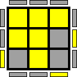 |
|  373/1296 |  429443 | 001:10100:01101:10000:011 | 0 | 0 |  |
|  374/1296 |  429450 | 001:10100:01101:10001:010 | 2 | 2 |  |
|  375/1296 |  429458 | 001:10100:01101:10010:010 | 1 | 1 |  |
|  376/1296 |  429473 | 001:10100:01101:10100:001 | 0 | 0 |  |
|  377/1296 |  429480 | 001:10100:01101:10101:000 | 2 | 2 |  |
|  378/1296 |  429488 | 001:10100:01101:10110:000 | 1 | 1 |  |
|  379/1296 |  429575 | 001:10100:01110:00000:111 | 2 | 2 |  |
|  380/1296 |  429582 | 001:10100:01110:00001:110 | 1 | 1 |  |
|  381/1296 |  429590 | 001:10100:01110:00010:110 | 0 | 0 |  |
|  382/1296 |  429605 | 001:10100:01110:00100:101 | 2 | 2 |  |
|  383/1296 |  429612 | 001:10100:01110:00101:100 | 1 | 1 |  |
|  384/1296 |  429620 | 001:10100:01110:00110:100 | 0 | 0 |  |
|  385/1296 |  429635 | 001:10100:01110:01000:011 | 1 | 1 |  |
|  386/1296 |  429642 | 001:10100:01110:01001:010 | 0 | 0 |  |
|  387/1296 |  429650 | 001:10100:01110:01010:010 | 2 | 2 |  |
|  388/1296 |  429665 | 001:10100:01110:01100:001 | 1 | 1 |  |
|  389/1296 |  429672 | 001:10100:01110:01101:000 | 0 | 0 |  |
|  390/1296 |  429680 | 001:10100:01110:01110:000 | 2 | 2 |  |
|  391/1296 |  429699 | 001:10100:01110:10000:011 | 0 | 0 |  |
|  392/1296 |  429706 | 001:10100:01110:10001:010 | 2 | 2 |  |
|  393/1296 |  429714 | 001:10100:01110:10010:010 | 1 | 1 |  |
|  394/1296 |  429729 | 001:10100:01110:10100:001 | 0 | 0 |  |
|  395/1296 |  429736 | 001:10100:01110:10101:000 | 2 | 2 |  |
|  396/1296 |  429744 | 001:10100:01110:10110:000 | 1 | 1 |  |
|  397/1296 |  431367 | 001:10100:10101:00000:111 | 2 | 2 |  |
|  398/1296 |  431374 | 001:10100:10101:00001:110 | 1 | 1 |  |
|  399/1296 |  431382 | 001:10100:10101:00010:110 | 0 | 0 |  |
|  400/1296 |  431397 | 001:10100:10101:00100:101 | 2 | 2 |  |
|  401/1296 |  431404 | 001:10100:10101:00101:100 | 1 | 1 |  |
|  402/1296 |  431412 | 001:10100:10101:00110:100 | 0 | 0 |  |
|  403/1296 |  431427 | 001:10100:10101:01000:011 | 1 | 1 |  |
|  404/1296 |  431434 | 001:10100:10101:01001:010 | 0 | 0 |  |
|  405/1296 |  431442 | 001:10100:10101:01010:010 | 2 | 2 |  |
|  406/1296 |  431457 | 001:10100:10101:01100:001 | 1 | 1 |  |
|  407/1296 |  431464 | 001:10100:10101:01101:000 | 0 | 0 |  |
|  408/1296 |  431472 | 001:10100:10101:01110:000 | 2 | 2 |  |
|  409/1296 |  431491 | 001:10100:10101:10000:011 | 0 | 0 |  |
|  410/1296 |  431498 | 001:10100:10101:10001:010 | 2 | 2 |  |
|  411/1296 |  431506 | 001:10100:10101:10010:010 | 1 | 1 |  |
|  412/1296 |  431521 | 001:10100:10101:10100:001 | 0 | 0 |  |
|  413/1296 |  431528 | 001:10100:10101:10101:000 | 2 | 2 |  |
|  414/1296 |  431536 | 001:10100:10101:10110:000 | 1 | 1 |  |
|  415/1296 |  431623 | 001:10100:10110:00000:111 | 2 | 2 |  |
|  416/1296 |  431630 | 001:10100:10110:00001:110 | 1 | 1 |  |
|  417/1296 |  431638 | 001:10100:10110:00010:110 | 0 | 0 |  |
|  418/1296 |  431653 | 001:10100:10110:00100:101 | 2 | 2 |  |
|  419/1296 |  431660 | 001:10100:10110:00101:100 | 1 | 1 |  |
|  420/1296 |  431668 | 001:10100:10110:00110:100 | 0 | 0 |  |
|  421/1296 |  431683 | 001:10100:10110:01000:011 | 1 | 1 |  |
|  422/1296 |  431690 | 001:10100:10110:01001:010 | 0 | 0 |  |
|  423/1296 |  431698 | 001:10100:10110:01010:010 | 2 | 2 |  |
|  424/1296 |  431713 | 001:10100:10110:01100:001 | 1 | 1 |  |
|  425/1296 |  431720 | 001:10100:10110:01101:000 | 0 | 0 |  |
|  426/1296 |  431728 | 001:10100:10110:01110:000 | 2 | 2 |  |
|  427/1296 |  431747 | 001:10100:10110:10000:011 | 0 | 0 |  |
|  428/1296 |  431754 | 001:10100:10110:10001:010 | 2 | 2 |  |
|  429/1296 |  431762 | 001:10100:10110:10010:010 | 1 | 1 |  |
|  430/1296 |  431777 | 001:10100:10110:10100:001 | 0 | 0 |  |
|  431/1296 |  431784 | 001:10100:10110:10101:000 | 2 | 2 |  |
|  432/1296 |  431792 | 001:10100:10110:10110:000 | 1 | 1 |  |
|  433/1296 |  601351 | 010:01001:01101:00000:111 | 2 | 2 |  |
|  434/1296 |  601358 | 010:01001:01101:00001:110 | 1 | 1 |  |
|  435/1296 |  601366 | 010:01001:01101:00010:110 | 0 | 0 |  |
|  436/1296 |  601381 | 010:01001:01101:00100:101 | 2 | 2 |  |
|  437/1296 |  601388 | 010:01001:01101:00101:100 | 1 | 1 |  |
|  438/1296 |  601396 | 010:01001:01101:00110:100 | 0 | 0 |  |
|  439/1296 |  601411 | 010:01001:01101:01000:011 | 1 | 1 |  |
|  440/1296 |  601418 | 010:01001:01101:01001:010 | 0 | 0 |  |
|  441/1296 |  601426 | 010:01001:01101:01010:010 | 2 | 2 |  |
|  442/1296 |  601441 | 010:01001:01101:01100:001 | 1 | 1 |  |
|  443/1296 |  601448 | 010:01001:01101:01101:000 | 0 | 0 |  |
|  444/1296 |  601456 | 010:01001:01101:01110:000 | 2 | 2 |  |
|  445/1296 |  601475 | 010:01001:01101:10000:011 | 0 | 0 |  |
|  446/1296 |  601482 | 010:01001:01101:10001:010 | 2 | 2 |  |
|  447/1296 |  601490 | 010:01001:01101:10010:010 | 1 | 1 |  |
|  448/1296 |  601505 | 010:01001:01101:10100:001 | 0 | 0 |  |
|  449/1296 |  601512 | 010:01001:01101:10101:000 | 2 | 2 |  |
|  450/1296 |  601520 | 010:01001:01101:10110:000 | 1 | 1 |  |
|  451/1296 |  601607 | 010:01001:01110:00000:111 | 2 | 2 |  |
|  452/1296 |  601614 | 010:01001:01110:00001:110 | 1 | 1 |  |
|  453/1296 |  601622 | 010:01001:01110:00010:110 | 0 | 0 |  |
|  454/1296 |  601637 | 010:01001:01110:00100:101 | 2 | 2 |  |
|  455/1296 |  601644 | 010:01001:01110:00101:100 | 1 | 1 |  |
|  456/1296 |  601652 | 010:01001:01110:00110:100 | 0 | 0 |  |
|  457/1296 |  601667 | 010:01001:01110:01000:011 | 1 | 1 |  |
|  458/1296 |  601674 | 010:01001:01110:01001:010 | 0 | 0 |  |
|  459/1296 |  601682 | 010:01001:01110:01010:010 | 2 | 2 |  |
|  460/1296 |  601697 | 010:01001:01110:01100:001 | 1 | 1 |  |
|  461/1296 |  601704 | 010:01001:01110:01101:000 | 0 | 0 |  |
|  462/1296 |  601712 | 010:01001:01110:01110:000 | 2 | 2 |  |
|  463/1296 |  601731 | 010:01001:01110:10000:011 | 0 | 0 |  |
|  464/1296 |  601738 | 010:01001:01110:10001:010 | 2 | 2 |  |
|  465/1296 |  601746 | 010:01001:01110:10010:010 | 1 | 1 |  |
|  466/1296 |  601761 | 010:01001:01110:10100:001 | 0 | 0 |  |
|  467/1296 |  601768 | 010:01001:01110:10101:000 | 2 | 2 |  |
|  468/1296 |  601776 | 010:01001:01110:10110:000 | 1 | 1 |  |
|  469/1296 |  603399 | 010:01001:10101:00000:111 | 2 | 2 |  |
|  470/1296 |  603406 | 010:01001:10101:00001:110 | 1 | 1 |  |
|  471/1296 |  603414 | 010:01001:10101:00010:110 | 0 | 0 |  |
|  472/1296 |  603429 | 010:01001:10101:00100:101 | 2 | 2 |  |
|  473/1296 |  603436 | 010:01001:10101:00101:100 | 1 | 1 |  |
|  474/1296 |  603444 | 010:01001:10101:00110:100 | 0 | 0 |  |
|  475/1296 |  603459 | 010:01001:10101:01000:011 | 1 | 1 |  |
|  476/1296 |  603466 | 010:01001:10101:01001:010 | 0 | 0 |  |
|  477/1296 |  603474 | 010:01001:10101:01010:010 | 2 | 2 |  |
|  478/1296 |  603489 | 010:01001:10101:01100:001 | 1 | 1 |  |
|  479/1296 |  603496 | 010:01001:10101:01101:000 | 0 | 0 |  |
|  480/1296 |  603504 | 010:01001:10101:01110:000 | 2 | 2 |  |
|  481/1296 |  603523 | 010:01001:10101:10000:011 | 0 | 0 |  |
|  482/1296 |  603530 | 010:01001:10101:10001:010 | 2 | 2 |  |
|  483/1296 |  603538 | 010:01001:10101:10010:010 | 1 | 1 |  |
|  484/1296 |  603553 | 010:01001:10101:10100:001 | 0 | 0 |  |
|  485/1296 |  603560 | 010:01001:10101:10101:000 | 2 | 2 |  |
|  486/1296 |  603568 | 010:01001:10101:10110:000 | 1 | 1 |  |
|  487/1296 |  603655 | 010:01001:10110:00000:111 | 2 | 2 |  |
|  488/1296 |  603662 | 010:01001:10110:00001:110 | 1 | 1 |  |
|  489/1296 |  603670 | 010:01001:10110:00010:110 | 0 | 0 |  |
|  490/1296 |  603685 | 010:01001:10110:00100:101 | 2 | 2 |  |
|  491/1296 |  603692 | 010:01001:10110:00101:100 | 1 | 1 |  |
|  492/1296 |  603700 | 010:01001:10110:00110:100 | 0 | 0 |  |
|  493/1296 |  603715 | 010:01001:10110:01000:011 | 1 | 1 |  |
|  494/1296 |  603722 | 010:01001:10110:01001:010 | 0 | 0 |  |
|  495/1296 |  603730 | 010:01001:10110:01010:010 | 2 | 2 |  |
|  496/1296 |  603745 | 010:01001:10110:01100:001 | 1 | 1 |  |
|  497/1296 |  603752 | 010:01001:10110:01101:000 | 0 | 0 |  |
|  498/1296 |  603760 | 010:01001:10110:01110:000 | 2 | 2 |  |
|  499/1296 |  603779 | 010:01001:10110:10000:011 | 0 | 0 |  |
|  500/1296 |  603786 | 010:01001:10110:10001:010 | 2 | 2 |  |
|  501/1296 |  603794 | 010:01001:10110:10010:010 | 1 | 1 |  |
|  502/1296 |  603809 | 010:01001:10110:10100:001 | 0 | 0 |  |
|  503/1296 |  603816 | 010:01001:10110:10101:000 | 2 | 2 |  |
|  504/1296 |  603824 | 010:01001:10110:10110:000 | 1 | 1 |  |
|  505/1296 |  609543 | 010:01010:01101:00000:111 | 0 | 0 |  |
|  506/1296 |  609550 | 010:01010:01101:00001:110 | 2 | 2 |  |
|  507/1296 |  609558 | 010:01010:01101:00010:110 | 1 | 1 |  |
|  508/1296 |  609573 | 010:01010:01101:00100:101 | 0 | 0 |  |
|  509/1296 |  609580 | 010:01010:01101:00101:100 | 2 | 2 |  |
|  510/1296 |  609588 | 010:01010:01101:00110:100 | 1 | 1 |  |
|  511/1296 |  609603 | 010:01010:01101:01000:011 | 2 | 2 |  |
|  512/1296 |  609610 | 010:01010:01101:01001:010 | 1 | 1 |  |
|  513/1296 |  609618 | 010:01010:01101:01010:010 | 0 | 0 |  |
|  514/1296 |  609633 | 010:01010:01101:01100:001 | 2 | 2 |  |
|  515/1296 |  609640 | 010:01010:01101:01101:000 | 1 | 1 |  |
|  516/1296 |  609648 | 010:01010:01101:01110:000 | 0 | 0 |  |
|  517/1296 |  609667 | 010:01010:01101:10000:011 | 1 | 1 |  |
|  518/1296 |  609674 | 010:01010:01101:10001:010 | 0 | 0 |  |
|  519/1296 |  609682 | 010:01010:01101:10010:010 | 2 | 2 |  |
|  520/1296 |  609697 | 010:01010:01101:10100:001 | 1 | 1 |  |
|  521/1296 |  609704 | 010:01010:01101:10101:000 | 0 | 0 |  |
|  522/1296 |  609712 | 010:01010:01101:10110:000 | 2 | 2 |  |
|  523/1296 |  609799 | 010:01010:01110:00000:111 | 0 | 0 |  |
|  524/1296 |  609806 | 010:01010:01110:00001:110 | 2 | 2 |  |
|  525/1296 |  609814 | 010:01010:01110:00010:110 | 1 | 1 |  |
|  526/1296 |  609829 | 010:01010:01110:00100:101 | 0 | 0 | 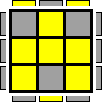 |
|  527/1296 |  609836 | 010:01010:01110:00101:100 | 2 | 2 |  |
|  528/1296 |  609844 | 010:01010:01110:00110:100 | 1 | 1 |  |
|  529/1296 |  609859 | 010:01010:01110:01000:011 | 2 | 2 |  |
|  530/1296 |  609866 | 010:01010:01110:01001:010 | 1 | 1 |  |
|  531/1296 |  609874 | 010:01010:01110:01010:010 | 0 | 0 |  |
|  532/1296 |  609889 | 010:01010:01110:01100:001 | 2 | 2 |  |
|  533/1296 |  609896 | 010:01010:01110:01101:000 | 1 | 1 |  |
|  534/1296 |  609904 | 010:01010:01110:01110:000 | 0 | 0 |  |
|  535/1296 |  609923 | 010:01010:01110:10000:011 | 1 | 1 |  |
|  536/1296 |  609930 | 010:01010:01110:10001:010 | 0 | 0 |  |
|  537/1296 |  609938 | 010:01010:01110:10010:010 | 2 | 2 |  |
|  538/1296 |  609953 | 010:01010:01110:10100:001 | 1 | 1 |  |
|  539/1296 |  609960 | 010:01010:01110:10101:000 | 0 | 0 |  |
|  540/1296 |  609968 | 010:01010:01110:10110:000 | 2 | 2 |  |
|  541/1296 |  611591 | 010:01010:10101:00000:111 | 0 | 0 |  |
|  542/1296 |  611598 | 010:01010:10101:00001:110 | 2 | 2 | 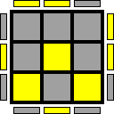 |
|  543/1296 |  611606 | 010:01010:10101:00010:110 | 1 | 1 |  |
|  544/1296 |  611621 | 010:01010:10101:00100:101 | 0 | 0 |  |
|  545/1296 |  611628 | 010:01010:10101:00101:100 | 2 | 2 |  |
|  546/1296 |  611636 | 010:01010:10101:00110:100 | 1 | 1 |  |
|  547/1296 |  611651 | 010:01010:10101:01000:011 | 2 | 2 |  |
|  548/1296 |  611658 | 010:01010:10101:01001:010 | 1 | 1 |  |
|  549/1296 |  611666 | 010:01010:10101:01010:010 | 0 | 0 |  |
|  550/1296 |  611681 | 010:01010:10101:01100:001 | 2 | 2 | 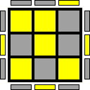 |
|  551/1296 |  611688 | 010:01010:10101:01101:000 | 1 | 1 |  |
|  552/1296 |  611696 | 010:01010:10101:01110:000 | 0 | 0 |  |
|  553/1296 |  611715 | 010:01010:10101:10000:011 | 1 | 1 |  |
|  554/1296 |  611722 | 010:01010:10101:10001:010 | 0 | 0 |  |
|  555/1296 |  611730 | 010:01010:10101:10010:010 | 2 | 2 |  |
|  556/1296 |  611745 | 010:01010:10101:10100:001 | 1 | 1 |  |
|  557/1296 |  611752 | 010:01010:10101:10101:000 | 0 | 0 |  |
|  558/1296 |  611760 | 010:01010:10101:10110:000 | 2 | 2 |  |
|  559/1296 |  611847 | 010:01010:10110:00000:111 | 0 | 0 |  |
|  560/1296 |  611854 | 010:01010:10110:00001:110 | 2 | 2 |  |
|  561/1296 |  611862 | 010:01010:10110:00010:110 | 1 | 1 |  |
|  562/1296 |  611877 | 010:01010:10110:00100:101 | 0 | 0 |  |
|  563/1296 |  611884 | 010:01010:10110:00101:100 | 2 | 2 |  |
|  564/1296 |  611892 | 010:01010:10110:00110:100 | 1 | 1 |  |
|  565/1296 |  611907 | 010:01010:10110:01000:011 | 2 | 2 |  |
|  566/1296 |  611914 | 010:01010:10110:01001:010 | 1 | 1 |  |
|  567/1296 |  611922 | 010:01010:10110:01010:010 | 0 | 0 |  |
|  568/1296 |  611937 | 010:01010:10110:01100:001 | 2 | 2 |  |
|  569/1296 |  611944 | 010:01010:10110:01101:000 | 1 | 1 |  |
|  570/1296 |  611952 | 010:01010:10110:01110:000 | 0 | 0 |  |
|  571/1296 |  611971 | 010:01010:10110:10000:011 | 1 | 1 |  |
|  572/1296 |  611978 | 010:01010:10110:10001:010 | 0 | 0 |  |
|  573/1296 |  611986 | 010:01010:10110:10010:010 | 2 | 2 |  |
|  574/1296 |  612001 | 010:01010:10110:10100:001 | 1 | 1 |  |
|  575/1296 |  612008 | 010:01010:10110:10101:000 | 0 | 0 |  |
|  576/1296 |  612016 | 010:01010:10110:10110:000 | 2 | 2 |  |
|  577/1296 |  666887 | 010:10001:01101:00000:111 | 0 | 0 |  |
|  578/1296 |  666894 | 010:10001:01101:00001:110 | 2 | 2 |  |
|  579/1296 |  666902 | 010:10001:01101:00010:110 | 1 | 1 |  |
|  580/1296 |  666917 | 010:10001:01101:00100:101 | 0 | 0 |  |
|  581/1296 |  666924 | 010:10001:01101:00101:100 | 2 | 2 |  |
|  582/1296 |  666932 | 010:10001:01101:00110:100 | 1 | 1 |  |
|  583/1296 |  666947 | 010:10001:01101:01000:011 | 2 | 2 |  |
|  584/1296 |  666954 | 010:10001:01101:01001:010 | 1 | 1 |  |
|  585/1296 |  666962 | 010:10001:01101:01010:010 | 0 | 0 |  |
|  586/1296 |  666977 | 010:10001:01101:01100:001 | 2 | 2 |  |
|  587/1296 |  666984 | 010:10001:01101:01101:000 | 1 | 1 |  |
|  588/1296 |  666992 | 010:10001:01101:01110:000 | 0 | 0 |  |
|  589/1296 |  667011 | 010:10001:01101:10000:011 | 1 | 1 |  |
|  590/1296 |  667018 | 010:10001:01101:10001:010 | 0 | 0 |  |
|  591/1296 |  667026 | 010:10001:01101:10010:010 | 2 | 2 |  |
|  592/1296 |  667041 | 010:10001:01101:10100:001 | 1 | 1 |  |
|  593/1296 |  667048 | 010:10001:01101:10101:000 | 0 | 0 |  |
|  594/1296 |  667056 | 010:10001:01101:10110:000 | 2 | 2 |  |
|  595/1296 |  667143 | 010:10001:01110:00000:111 | 0 | 0 |  |
|  596/1296 |  667150 | 010:10001:01110:00001:110 | 2 | 2 |  |
|  597/1296 |  667158 | 010:10001:01110:00010:110 | 1 | 1 |  |
|  598/1296 |  667173 | 010:10001:01110:00100:101 | 0 | 0 |  |
|  599/1296 |  667180 | 010:10001:01110:00101:100 | 2 | 2 |  |
|  600/1296 |  667188 | 010:10001:01110:00110:100 | 1 | 1 |  |
|  601/1296 |  667203 | 010:10001:01110:01000:011 | 2 | 2 |  |
|  602/1296 |  667210 | 010:10001:01110:01001:010 | 1 | 1 |  |
|  603/1296 |  667218 | 010:10001:01110:01010:010 | 0 | 0 |  |
|  604/1296 |  667233 | 010:10001:01110:01100:001 | 2 | 2 |  |
|  605/1296 |  667240 | 010:10001:01110:01101:000 | 1 | 1 |  |
|  606/1296 |  667248 | 010:10001:01110:01110:000 | 0 | 0 |  |
|  607/1296 |  667267 | 010:10001:01110:10000:011 | 1 | 1 |  |
|  608/1296 |  667274 | 010:10001:01110:10001:010 | 0 | 0 |  |
|  609/1296 |  667282 | 010:10001:01110:10010:010 | 2 | 2 |  |
|  610/1296 |  667297 | 010:10001:01110:10100:001 | 1 | 1 |  |
|  611/1296 |  667304 | 010:10001:01110:10101:000 | 0 | 0 |  |
|  612/1296 |  667312 | 010:10001:01110:10110:000 | 2 | 2 |  |
|  613/1296 |  668935 | 010:10001:10101:00000:111 | 0 | 0 |  |
|  614/1296 |  668942 | 010:10001:10101:00001:110 | 2 | 2 |  |
|  615/1296 |  668950 | 010:10001:10101:00010:110 | 1 | 1 |  |
|  616/1296 |  668965 | 010:10001:10101:00100:101 | 0 | 0 |  |
|  617/1296 |  668972 | 010:10001:10101:00101:100 | 2 | 2 |  |
|  618/1296 |  668980 | 010:10001:10101:00110:100 | 1 | 1 |  |
|  619/1296 |  668995 | 010:10001:10101:01000:011 | 2 | 2 |  |
|  620/1296 |  669002 | 010:10001:10101:01001:010 | 1 | 1 |  |
|  621/1296 |  669010 | 010:10001:10101:01010:010 | 0 | 0 |  |
|  622/1296 |  669025 | 010:10001:10101:01100:001 | 2 | 2 |  |
|  623/1296 |  669032 | 010:10001:10101:01101:000 | 1 | 1 |  |
|  624/1296 |  669040 | 010:10001:10101:01110:000 | 0 | 0 |  |
|  625/1296 |  669059 | 010:10001:10101:10000:011 | 1 | 1 |  |
|  626/1296 |  669066 | 010:10001:10101:10001:010 | 0 | 0 |  |
|  627/1296 |  669074 | 010:10001:10101:10010:010 | 2 | 2 |  |
|  628/1296 |  669089 | 010:10001:10101:10100:001 | 1 | 1 |  |
|  629/1296 |  669096 | 010:10001:10101:10101:000 | 0 | 0 |  |
|  630/1296 |  669104 | 010:10001:10101:10110:000 | 2 | 2 |  |
|  631/1296 |  669191 | 010:10001:10110:00000:111 | 0 | 0 |  |
|  632/1296 |  669198 | 010:10001:10110:00001:110 | 2 | 2 |  |
|  633/1296 |  669206 | 010:10001:10110:00010:110 | 1 | 1 |  |
|  634/1296 |  669221 | 010:10001:10110:00100:101 | 0 | 0 |  |
|  635/1296 |  669228 | 010:10001:10110:00101:100 | 2 | 2 |  |
|  636/1296 |  669236 | 010:10001:10110:00110:100 | 1 | 1 |  |
|  637/1296 |  669251 | 010:10001:10110:01000:011 | 2 | 2 |  |
|  638/1296 |  669258 | 010:10001:10110:01001:010 | 1 | 1 |  |
|  639/1296 |  669266 | 010:10001:10110:01010:010 | 0 | 0 |  |
|  640/1296 |  669281 | 010:10001:10110:01100:001 | 2 | 2 |  |
|  641/1296 |  669288 | 010:10001:10110:01101:000 | 1 | 1 |  |
|  642/1296 |  669296 | 010:10001:10110:01110:000 | 0 | 0 |  |
|  643/1296 |  669315 | 010:10001:10110:10000:011 | 1 | 1 |  |
|  644/1296 |  669322 | 010:10001:10110:10001:010 | 0 | 0 |  |
|  645/1296 |  669330 | 010:10001:10110:10010:010 | 2 | 2 |  |
|  646/1296 |  669345 | 010:10001:10110:10100:001 | 1 | 1 |  |
|  647/1296 |  669352 | 010:10001:10110:10101:000 | 0 | 0 |  |
|  648/1296 |  669360 | 010:10001:10110:10110:000 | 2 | 2 |  |
|  649/1296 |  675079 | 010:10010:01101:00000:111 | 1 | 1 |  |
|  650/1296 |  675086 | 010:10010:01101:00001:110 | 0 | 0 |  |
|  651/1296 |  675094 | 010:10010:01101:00010:110 | 2 | 2 |  |
|  652/1296 |  675109 | 010:10010:01101:00100:101 | 1 | 1 |  |
|  653/1296 |  675116 | 010:10010:01101:00101:100 | 0 | 0 |  |
|  654/1296 |  675124 | 010:10010:01101:00110:100 | 2 | 2 |  |
|  655/1296 |  675139 | 010:10010:01101:01000:011 | 0 | 0 |  |
|  656/1296 |  675146 | 010:10010:01101:01001:010 | 2 | 2 |  |
|  657/1296 |  675154 | 010:10010:01101:01010:010 | 1 | 1 |  |
|  658/1296 |  675169 | 010:10010:01101:01100:001 | 0 | 0 |  |
|  659/1296 |  675176 | 010:10010:01101:01101:000 | 2 | 2 |  |
|  660/1296 |  675184 | 010:10010:01101:01110:000 | 1 | 1 |  |
|  661/1296 |  675203 | 010:10010:01101:10000:011 | 2 | 2 |  |
|  662/1296 |  675210 | 010:10010:01101:10001:010 | 1 | 1 |  |
|  663/1296 |  675218 | 010:10010:01101:10010:010 | 0 | 0 |  |
|  664/1296 |  675233 | 010:10010:01101:10100:001 | 2 | 2 |  |
|  665/1296 |  675240 | 010:10010:01101:10101:000 | 1 | 1 |  |
|  666/1296 |  675248 | 010:10010:01101:10110:000 | 0 | 0 |  |
|  667/1296 |  675335 | 010:10010:01110:00000:111 | 1 | 1 |  |
|  668/1296 |  675342 | 010:10010:01110:00001:110 | 0 | 0 |  |
|  669/1296 |  675350 | 010:10010:01110:00010:110 | 2 | 2 |  |
|  670/1296 |  675365 | 010:10010:01110:00100:101 | 1 | 1 |  |
|  671/1296 |  675372 | 010:10010:01110:00101:100 | 0 | 0 |  |
|  672/1296 |  675380 | 010:10010:01110:00110:100 | 2 | 2 |  |
|  673/1296 |  675395 | 010:10010:01110:01000:011 | 0 | 0 |  |
|  674/1296 |  675402 | 010:10010:01110:01001:010 | 2 | 2 |  |
|  675/1296 |  675410 | 010:10010:01110:01010:010 | 1 | 1 |  |
|  676/1296 |  675425 | 010:10010:01110:01100:001 | 0 | 0 | 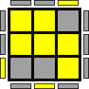 |
|  677/1296 |  675432 | 010:10010:01110:01101:000 | 2 | 2 |  |
|  678/1296 |  675440 | 010:10010:01110:01110:000 | 1 | 1 |  |
|  679/1296 |  675459 | 010:10010:01110:10000:011 | 2 | 2 |  |
|  680/1296 |  675466 | 010:10010:01110:10001:010 | 1 | 1 |  |
|  681/1296 |  675474 | 010:10010:01110:10010:010 | 0 | 0 |  |
|  682/1296 |  675489 | 010:10010:01110:10100:001 | 2 | 2 |  |
|  683/1296 |  675496 | 010:10010:01110:10101:000 | 1 | 1 |  |
|  684/1296 |  675504 | 010:10010:01110:10110:000 | 0 | 0 |  |
|  685/1296 |  677127 | 010:10010:10101:00000:111 | 1 | 1 |  |
|  686/1296 |  677134 | 010:10010:10101:00001:110 | 0 | 0 |  |
|  687/1296 |  677142 | 010:10010:10101:00010:110 | 2 | 2 |  |
|  688/1296 |  677157 | 010:10010:10101:00100:101 | 1 | 1 |  |
|  689/1296 |  677164 | 010:10010:10101:00101:100 | 0 | 0 |  |
|  690/1296 |  677172 | 010:10010:10101:00110:100 | 2 | 2 |  |
|  691/1296 |  677187 | 010:10010:10101:01000:011 | 0 | 0 |  |
|  692/1296 |  677194 | 010:10010:10101:01001:010 | 2 | 2 |  |
|  693/1296 |  677202 | 010:10010:10101:01010:010 | 1 | 1 |  |
|  694/1296 |  677217 | 010:10010:10101:01100:001 | 0 | 0 |  |
|  695/1296 |  677224 | 010:10010:10101:01101:000 | 2 | 2 |  |
|  696/1296 |  677232 | 010:10010:10101:01110:000 | 1 | 1 |  |
|  697/1296 |  677251 | 010:10010:10101:10000:011 | 2 | 2 |  |
|  698/1296 |  677258 | 010:10010:10101:10001:010 | 1 | 1 |  |
|  699/1296 |  677266 | 010:10010:10101:10010:010 | 0 | 0 |  |
|  700/1296 |  677281 | 010:10010:10101:10100:001 | 2 | 2 |  |
|  701/1296 |  677288 | 010:10010:10101:10101:000 | 1 | 1 |  |
|  702/1296 |  677296 | 010:10010:10101:10110:000 | 0 | 0 |  |
|  703/1296 |  677383 | 010:10010:10110:00000:111 | 1 | 1 |  |
|  704/1296 |  677390 | 010:10010:10110:00001:110 | 0 | 0 |  |
|  705/1296 |  677398 | 010:10010:10110:00010:110 | 2 | 2 |  |
|  706/1296 |  677413 | 010:10010:10110:00100:101 | 1 | 1 |  |
|  707/1296 |  677420 | 010:10010:10110:00101:100 | 0 | 0 |  |
|  708/1296 |  677428 | 010:10010:10110:00110:100 | 2 | 2 |  |
|  709/1296 |  677443 | 010:10010:10110:01000:011 | 0 | 0 |  |
|  710/1296 |  677450 | 010:10010:10110:01001:010 | 2 | 2 |  |
|  711/1296 |  677458 | 010:10010:10110:01010:010 | 1 | 1 |  |
|  712/1296 |  677473 | 010:10010:10110:01100:001 | 0 | 0 |  |
|  713/1296 |  677480 | 010:10010:10110:01101:000 | 2 | 2 |  |
|  714/1296 |  677488 | 010:10010:10110:01110:000 | 1 | 1 |  |
|  715/1296 |  677507 | 010:10010:10110:10000:011 | 2 | 2 |  |
|  716/1296 |  677514 | 010:10010:10110:10001:010 | 1 | 1 |  |
|  717/1296 |  677522 | 010:10010:10110:10010:010 | 0 | 0 |  |
|  718/1296 |  677537 | 010:10010:10110:10100:001 | 2 | 2 |  |
|  719/1296 |  677544 | 010:10010:10110:10101:000 | 1 | 1 |  |
|  720/1296 |  677552 | 010:10010:10110:10110:000 | 0 | 0 |  |
|  721/1296 |  855303 | 011:01000:01101:00000:111 | 1 | 1 |  |
|  722/1296 |  855310 | 011:01000:01101:00001:110 | 0 | 0 |  |
|  723/1296 |  855318 | 011:01000:01101:00010:110 | 2 | 2 |  |
|  724/1296 |  855333 | 011:01000:01101:00100:101 | 1 | 1 |  |
|  725/1296 |  855340 | 011:01000:01101:00101:100 | 0 | 0 |  |
|  726/1296 |  855348 | 011:01000:01101:00110:100 | 2 | 2 |  |
|  727/1296 |  855363 | 011:01000:01101:01000:011 | 0 | 0 |  |
|  728/1296 |  855370 | 011:01000:01101:01001:010 | 2 | 2 |  |
|  729/1296 |  855378 | 011:01000:01101:01010:010 | 1 | 1 |  |
|  730/1296 |  855393 | 011:01000:01101:01100:001 | 0 | 0 |  |
|  731/1296 |  855400 | 011:01000:01101:01101:000 | 2 | 2 |  |
|  732/1296 |  855408 | 011:01000:01101:01110:000 | 1 | 1 |  |
|  733/1296 |  855427 | 011:01000:01101:10000:011 | 2 | 2 |  |
|  734/1296 |  855434 | 011:01000:01101:10001:010 | 1 | 1 |  |
|  735/1296 |  855442 | 011:01000:01101:10010:010 | 0 | 0 |  |
|  736/1296 |  855457 | 011:01000:01101:10100:001 | 2 | 2 |  |
|  737/1296 |  855464 | 011:01000:01101:10101:000 | 1 | 1 |  |
|  738/1296 |  855472 | 011:01000:01101:10110:000 | 0 | 0 |  |
|  739/1296 |  855559 | 011:01000:01110:00000:111 | 1 | 1 |  |
|  740/1296 |  855566 | 011:01000:01110:00001:110 | 0 | 0 |  |
|  741/1296 |  855574 | 011:01000:01110:00010:110 | 2 | 2 |  |
|  742/1296 |  855589 | 011:01000:01110:00100:101 | 1 | 1 |  |
|  743/1296 |  855596 | 011:01000:01110:00101:100 | 0 | 0 |  |
|  744/1296 |  855604 | 011:01000:01110:00110:100 | 2 | 2 |  |
|  745/1296 |  855619 | 011:01000:01110:01000:011 | 0 | 0 |  |
|  746/1296 |  855626 | 011:01000:01110:01001:010 | 2 | 2 |  |
|  747/1296 |  855634 | 011:01000:01110:01010:010 | 1 | 1 |  |
|  748/1296 |  855649 | 011:01000:01110:01100:001 | 0 | 0 |  |
|  749/1296 |  855656 | 011:01000:01110:01101:000 | 2 | 2 |  |
|  750/1296 |  855664 | 011:01000:01110:01110:000 | 1 | 1 |  |
|  751/1296 |  855683 | 011:01000:01110:10000:011 | 2 | 2 |  |
|  752/1296 |  855690 | 011:01000:01110:10001:010 | 1 | 1 |  |
|  753/1296 |  855698 | 011:01000:01110:10010:010 | 0 | 0 |  |
|  754/1296 |  855713 | 011:01000:01110:10100:001 | 2 | 2 |  |
|  755/1296 |  855720 | 011:01000:01110:10101:000 | 1 | 1 |  |
|  756/1296 |  855728 | 011:01000:01110:10110:000 | 0 | 0 |  |
|  757/1296 |  857351 | 011:01000:10101:00000:111 | 1 | 1 |  |
|  758/1296 |  857358 | 011:01000:10101:00001:110 | 0 | 0 |  |
|  759/1296 |  857366 | 011:01000:10101:00010:110 | 2 | 2 |  |
|  760/1296 |  857381 | 011:01000:10101:00100:101 | 1 | 1 |  |
|  761/1296 |  857388 | 011:01000:10101:00101:100 | 0 | 0 | 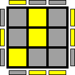 |
|  762/1296 |  857396 | 011:01000:10101:00110:100 | 2 | 2 |  |
|  763/1296 |  857411 | 011:01000:10101:01000:011 | 0 | 0 |  |
|  764/1296 |  857418 | 011:01000:10101:01001:010 | 2 | 2 |  |
|  765/1296 |  857426 | 011:01000:10101:01010:010 | 1 | 1 |  |
|  766/1296 |  857441 | 011:01000:10101:01100:001 | 0 | 0 |  |
|  767/1296 |  857448 | 011:01000:10101:01101:000 | 2 | 2 |  |
|  768/1296 |  857456 | 011:01000:10101:01110:000 | 1 | 1 |  |
|  769/1296 |  857475 | 011:01000:10101:10000:011 | 2 | 2 |  |
|  770/1296 |  857482 | 011:01000:10101:10001:010 | 1 | 1 |  |
|  771/1296 |  857490 | 011:01000:10101:10010:010 | 0 | 0 |  |
|  772/1296 |  857505 | 011:01000:10101:10100:001 | 2 | 2 |  |
|  773/1296 |  857512 | 011:01000:10101:10101:000 | 1 | 1 |  |
|  774/1296 |  857520 | 011:01000:10101:10110:000 | 0 | 0 |  |
|  775/1296 |  857607 | 011:01000:10110:00000:111 | 1 | 1 |  |
|  776/1296 |  857614 | 011:01000:10110:00001:110 | 0 | 0 |  |
|  777/1296 |  857622 | 011:01000:10110:00010:110 | 2 | 2 |  |
|  778/1296 |  857637 | 011:01000:10110:00100:101 | 1 | 1 |  |
|  779/1296 |  857644 | 011:01000:10110:00101:100 | 0 | 0 |  |
|  780/1296 |  857652 | 011:01000:10110:00110:100 | 2 | 2 |  |
|  781/1296 |  857667 | 011:01000:10110:01000:011 | 0 | 0 |  |
|  782/1296 |  857674 | 011:01000:10110:01001:010 | 2 | 2 |  |
|  783/1296 |  857682 | 011:01000:10110:01010:010 | 1 | 1 |  |
|  784/1296 |  857697 | 011:01000:10110:01100:001 | 0 | 0 |  |
|  785/1296 |  857704 | 011:01000:10110:01101:000 | 2 | 2 |  |
|  786/1296 |  857712 | 011:01000:10110:01110:000 | 1 | 1 |  |
|  787/1296 |  857731 | 011:01000:10110:10000:011 | 2 | 2 |  |
|  788/1296 |  857738 | 011:01000:10110:10001:010 | 1 | 1 |  |
|  789/1296 |  857746 | 011:01000:10110:10010:010 | 0 | 0 |  |
|  790/1296 |  857761 | 011:01000:10110:10100:001 | 2 | 2 |  |
|  791/1296 |  857768 | 011:01000:10110:10101:000 | 1 | 1 |  |
|  792/1296 |  857776 | 011:01000:10110:10110:000 | 0 | 0 |  |
|  793/1296 |  920839 | 011:10000:01101:00000:111 | 2 | 2 |  |
|  794/1296 |  920846 | 011:10000:01101:00001:110 | 1 | 1 |  |
|  795/1296 |  920854 | 011:10000:01101:00010:110 | 0 | 0 |  |
|  796/1296 |  920869 | 011:10000:01101:00100:101 | 2 | 2 |  |
|  797/1296 |  920876 | 011:10000:01101:00101:100 | 1 | 1 |  |
|  798/1296 |  920884 | 011:10000:01101:00110:100 | 0 | 0 |  |
|  799/1296 |  920899 | 011:10000:01101:01000:011 | 1 | 1 |  |
|  800/1296 |  920906 | 011:10000:01101:01001:010 | 0 | 0 |  |
|  801/1296 |  920914 | 011:10000:01101:01010:010 | 2 | 2 |  |
|  802/1296 |  920929 | 011:10000:01101:01100:001 | 1 | 1 |  |
|  803/1296 |  920936 | 011:10000:01101:01101:000 | 0 | 0 |  |
|  804/1296 |  920944 | 011:10000:01101:01110:000 | 2 | 2 |  |
|  805/1296 |  920963 | 011:10000:01101:10000:011 | 0 | 0 |  |
|  806/1296 |  920970 | 011:10000:01101:10001:010 | 2 | 2 |  |
|  807/1296 |  920978 | 011:10000:01101:10010:010 | 1 | 1 |  |
|  808/1296 |  920993 | 011:10000:01101:10100:001 | 0 | 0 |  |
|  809/1296 |  921000 | 011:10000:01101:10101:000 | 2 | 2 |  |
|  810/1296 |  921008 | 011:10000:01101:10110:000 | 1 | 1 |  |
|  811/1296 |  921095 | 011:10000:01110:00000:111 | 2 | 2 |  |
|  812/1296 |  921102 | 011:10000:01110:00001:110 | 1 | 1 |  |
|  813/1296 |  921110 | 011:10000:01110:00010:110 | 0 | 0 |  |
|  814/1296 |  921125 | 011:10000:01110:00100:101 | 2 | 2 |  |
|  815/1296 |  921132 | 011:10000:01110:00101:100 | 1 | 1 |  |
|  816/1296 |  921140 | 011:10000:01110:00110:100 | 0 | 0 |  |
|  817/1296 |  921155 | 011:10000:01110:01000:011 | 1 | 1 |  |
|  818/1296 |  921162 | 011:10000:01110:01001:010 | 0 | 0 |  |
|  819/1296 |  921170 | 011:10000:01110:01010:010 | 2 | 2 |  |
|  820/1296 |  921185 | 011:10000:01110:01100:001 | 1 | 1 |  |
|  821/1296 |  921192 | 011:10000:01110:01101:000 | 0 | 0 |  |
|  822/1296 |  921200 | 011:10000:01110:01110:000 | 2 | 2 |  |
|  823/1296 |  921219 | 011:10000:01110:10000:011 | 0 | 0 |  |
|  824/1296 |  921226 | 011:10000:01110:10001:010 | 2 | 2 |  |
|  825/1296 |  921234 | 011:10000:01110:10010:010 | 1 | 1 |  |
|  826/1296 |  921249 | 011:10000:01110:10100:001 | 0 | 0 |  |
|  827/1296 |  921256 | 011:10000:01110:10101:000 | 2 | 2 |  |
|  828/1296 |  921264 | 011:10000:01110:10110:000 | 1 | 1 |  |
|  829/1296 |  922887 | 011:10000:10101:00000:111 | 2 | 2 |  |
|  830/1296 |  922894 | 011:10000:10101:00001:110 | 1 | 1 |  |
|  831/1296 |  922902 | 011:10000:10101:00010:110 | 0 | 0 |  |
|  832/1296 |  922917 | 011:10000:10101:00100:101 | 2 | 2 |  |
|  833/1296 |  922924 | 011:10000:10101:00101:100 | 1 | 1 |  |
|  834/1296 |  922932 | 011:10000:10101:00110:100 | 0 | 0 |  |
|  835/1296 |  922947 | 011:10000:10101:01000:011 | 1 | 1 |  |
|  836/1296 |  922954 | 011:10000:10101:01001:010 | 0 | 0 |  |
|  837/1296 |  922962 | 011:10000:10101:01010:010 | 2 | 2 |  |
|  838/1296 |  922977 | 011:10000:10101:01100:001 | 1 | 1 |  |
|  839/1296 |  922984 | 011:10000:10101:01101:000 | 0 | 0 |  |
|  840/1296 |  922992 | 011:10000:10101:01110:000 | 2 | 2 |  |
|  841/1296 |  923011 | 011:10000:10101:10000:011 | 0 | 0 |  |
|  842/1296 |  923018 | 011:10000:10101:10001:010 | 2 | 2 |  |
|  843/1296 |  923026 | 011:10000:10101:10010:010 | 1 | 1 |  |
|  844/1296 |  923041 | 011:10000:10101:10100:001 | 0 | 0 |  |
|  845/1296 |  923048 | 011:10000:10101:10101:000 | 2 | 2 |  |
|  846/1296 |  923056 | 011:10000:10101:10110:000 | 1 | 1 |  |
|  847/1296 |  923143 | 011:10000:10110:00000:111 | 2 | 2 |  |
|  848/1296 |  923150 | 011:10000:10110:00001:110 | 1 | 1 |  |
|  849/1296 |  923158 | 011:10000:10110:00010:110 | 0 | 0 |  |
|  850/1296 |  923173 | 011:10000:10110:00100:101 | 2 | 2 |  |
|  851/1296 |  923180 | 011:10000:10110:00101:100 | 1 | 1 |  |
|  852/1296 |  923188 | 011:10000:10110:00110:100 | 0 | 0 |  |
|  853/1296 |  923203 | 011:10000:10110:01000:011 | 1 | 1 |  |
|  854/1296 |  923210 | 011:10000:10110:01001:010 | 0 | 0 |  |
|  855/1296 |  923218 | 011:10000:10110:01010:010 | 2 | 2 |  |
|  856/1296 |  923233 | 011:10000:10110:01100:001 | 1 | 1 |  |
|  857/1296 |  923240 | 011:10000:10110:01101:000 | 0 | 0 |  |
|  858/1296 |  923248 | 011:10000:10110:01110:000 | 2 | 2 |  |
|  859/1296 |  923267 | 011:10000:10110:10000:011 | 0 | 0 |  |
|  860/1296 |  923274 | 011:10000:10110:10001:010 | 2 | 2 |  |
|  861/1296 |  923282 | 011:10000:10110:10010:010 | 1 | 1 |  |
|  862/1296 |  923297 | 011:10000:10110:10100:001 | 0 | 0 |  |
|  863/1296 |  923304 | 011:10000:10110:10101:000 | 2 | 2 |  |
|  864/1296 |  923312 | 011:10000:10110:10110:000 | 1 | 1 |  |
|  865/1296 | 1092871 | 100:00101:01101:00000:111 | 1 | 1 |  |
|  866/1296 | 1092878 | 100:00101:01101:00001:110 | 0 | 0 |  |
|  867/1296 | 1092886 | 100:00101:01101:00010:110 | 2 | 2 |  |
|  868/1296 | 1092901 | 100:00101:01101:00100:101 | 1 | 1 |  |
|  869/1296 | 1092908 | 100:00101:01101:00101:100 | 0 | 0 |  |
|  870/1296 | 1092916 | 100:00101:01101:00110:100 | 2 | 2 |  |
|  871/1296 | 1092931 | 100:00101:01101:01000:011 | 0 | 0 |  |
|  872/1296 | 1092938 | 100:00101:01101:01001:010 | 2 | 2 |  |
|  873/1296 | 1092946 | 100:00101:01101:01010:010 | 1 | 1 |  |
|  874/1296 | 1092961 | 100:00101:01101:01100:001 | 0 | 0 |  |
|  875/1296 | 1092968 | 100:00101:01101:01101:000 | 2 | 2 |  |
|  876/1296 | 1092976 | 100:00101:01101:01110:000 | 1 | 1 |  |
|  877/1296 | 1092995 | 100:00101:01101:10000:011 | 2 | 2 |  |
|  878/1296 | 1093002 | 100:00101:01101:10001:010 | 1 | 1 |  |
|  879/1296 | 1093010 | 100:00101:01101:10010:010 | 0 | 0 |  |
|  880/1296 | 1093025 | 100:00101:01101:10100:001 | 2 | 2 |  |
|  881/1296 | 1093032 | 100:00101:01101:10101:000 | 1 | 1 |  |
|  882/1296 | 1093040 | 100:00101:01101:10110:000 | 0 | 0 |  |
|  883/1296 | 1093127 | 100:00101:01110:00000:111 | 1 | 1 |  |
|  884/1296 | 1093134 | 100:00101:01110:00001:110 | 0 | 0 |  |
|  885/1296 | 1093142 | 100:00101:01110:00010:110 | 2 | 2 |  |
|  886/1296 | 1093157 | 100:00101:01110:00100:101 | 1 | 1 |  |
|  887/1296 | 1093164 | 100:00101:01110:00101:100 | 0 | 0 |  |
|  888/1296 | 1093172 | 100:00101:01110:00110:100 | 2 | 2 |  |
|  889/1296 | 1093187 | 100:00101:01110:01000:011 | 0 | 0 |  |
|  890/1296 | 1093194 | 100:00101:01110:01001:010 | 2 | 2 | 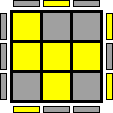 |
|  891/1296 | 1093202 | 100:00101:01110:01010:010 | 1 | 1 | 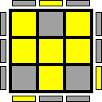 |
|  892/1296 | 1093217 | 100:00101:01110:01100:001 | 0 | 0 |  |
|  893/1296 | 1093224 | 100:00101:01110:01101:000 | 2 | 2 |  |
|  894/1296 | 1093232 | 100:00101:01110:01110:000 | 1 | 1 |  |
|  895/1296 | 1093251 | 100:00101:01110:10000:011 | 2 | 2 |  |
|  896/1296 | 1093258 | 100:00101:01110:10001:010 | 1 | 1 |  |
|  897/1296 | 1093266 | 100:00101:01110:10010:010 | 0 | 0 |  |
|  898/1296 | 1093281 | 100:00101:01110:10100:001 | 2 | 2 |  |
|  899/1296 | 1093288 | 100:00101:01110:10101:000 | 1 | 1 |  |
|  900/1296 | 1093296 | 100:00101:01110:10110:000 | 0 | 0 |  |
|  901/1296 | 1094919 | 100:00101:10101:00000:111 | 1 | 1 |  |
|  902/1296 | 1094926 | 100:00101:10101:00001:110 | 0 | 0 |  |
|  903/1296 | 1094934 | 100:00101:10101:00010:110 | 2 | 2 |  |
|  904/1296 | 1094949 | 100:00101:10101:00100:101 | 1 | 1 |  |
|  905/1296 | 1094956 | 100:00101:10101:00101:100 | 0 | 0 |  |
|  906/1296 | 1094964 | 100:00101:10101:00110:100 | 2 | 2 |  |
|  907/1296 | 1094979 | 100:00101:10101:01000:011 | 0 | 0 |  |
|  908/1296 | 1094986 | 100:00101:10101:01001:010 | 2 | 2 |  |
|  909/1296 | 1094994 | 100:00101:10101:01010:010 | 1 | 1 |  |
|  910/1296 | 1095009 | 100:00101:10101:01100:001 | 0 | 0 |  |
|  911/1296 | 1095016 | 100:00101:10101:01101:000 | 2 | 2 |  |
|  912/1296 | 1095024 | 100:00101:10101:01110:000 | 1 | 1 |  |
|  913/1296 | 1095043 | 100:00101:10101:10000:011 | 2 | 2 |  |
|  914/1296 | 1095050 | 100:00101:10101:10001:010 | 1 | 1 |  |
|  915/1296 | 1095058 | 100:00101:10101:10010:010 | 0 | 0 |  |
|  916/1296 | 1095073 | 100:00101:10101:10100:001 | 2 | 2 |  |
|  917/1296 | 1095080 | 100:00101:10101:10101:000 | 1 | 1 |  |
|  918/1296 | 1095088 | 100:00101:10101:10110:000 | 0 | 0 |  |
|  919/1296 | 1095175 | 100:00101:10110:00000:111 | 1 | 1 |  |
|  920/1296 | 1095182 | 100:00101:10110:00001:110 | 0 | 0 |  |
|  921/1296 | 1095190 | 100:00101:10110:00010:110 | 2 | 2 |  |
|  922/1296 | 1095205 | 100:00101:10110:00100:101 | 1 | 1 |  |
|  923/1296 | 1095212 | 100:00101:10110:00101:100 | 0 | 0 |  |
|  924/1296 | 1095220 | 100:00101:10110:00110:100 | 2 | 2 |  |
|  925/1296 | 1095235 | 100:00101:10110:01000:011 | 0 | 0 |  |
|  926/1296 | 1095242 | 100:00101:10110:01001:010 | 2 | 2 |  |
|  927/1296 | 1095250 | 100:00101:10110:01010:010 | 1 | 1 |  |
|  928/1296 | 1095265 | 100:00101:10110:01100:001 | 0 | 0 |  |
|  929/1296 | 1095272 | 100:00101:10110:01101:000 | 2 | 2 |  |
|  930/1296 | 1095280 | 100:00101:10110:01110:000 | 1 | 1 |  |
|  931/1296 | 1095299 | 100:00101:10110:10000:011 | 2 | 2 |  |
|  932/1296 | 1095306 | 100:00101:10110:10001:010 | 1 | 1 |  |
|  933/1296 | 1095314 | 100:00101:10110:10010:010 | 0 | 0 |  |
|  934/1296 | 1095329 | 100:00101:10110:10100:001 | 2 | 2 |  |
|  935/1296 | 1095336 | 100:00101:10110:10101:000 | 1 | 1 |  |
|  936/1296 | 1095344 | 100:00101:10110:10110:000 | 0 | 0 |  |
|  937/1296 | 1101063 | 100:00110:01101:00000:111 | 2 | 2 |  |
|  938/1296 | 1101070 | 100:00110:01101:00001:110 | 1 | 1 |  |
|  939/1296 | 1101078 | 100:00110:01101:00010:110 | 0 | 0 |  |
|  940/1296 | 1101093 | 100:00110:01101:00100:101 | 2 | 2 |  |
|  941/1296 | 1101100 | 100:00110:01101:00101:100 | 1 | 1 |  |
|  942/1296 | 1101108 | 100:00110:01101:00110:100 | 0 | 0 |  |
|  943/1296 | 1101123 | 100:00110:01101:01000:011 | 1 | 1 |  |
|  944/1296 | 1101130 | 100:00110:01101:01001:010 | 0 | 0 |  |
|  945/1296 | 1101138 | 100:00110:01101:01010:010 | 2 | 2 |  |
|  946/1296 | 1101153 | 100:00110:01101:01100:001 | 1 | 1 |  |
|  947/1296 | 1101160 | 100:00110:01101:01101:000 | 0 | 0 |  |
|  948/1296 | 1101168 | 100:00110:01101:01110:000 | 2 | 2 |  |
|  949/1296 | 1101187 | 100:00110:01101:10000:011 | 0 | 0 |  |
|  950/1296 | 1101194 | 100:00110:01101:10001:010 | 2 | 2 |  |
|  951/1296 | 1101202 | 100:00110:01101:10010:010 | 1 | 1 |  |
|  952/1296 | 1101217 | 100:00110:01101:10100:001 | 0 | 0 |  |
|  953/1296 | 1101224 | 100:00110:01101:10101:000 | 2 | 2 |  |
|  954/1296 | 1101232 | 100:00110:01101:10110:000 | 1 | 1 | 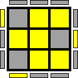 |
|  955/1296 | 1101319 | 100:00110:01110:00000:111 | 2 | 2 |  |
|  956/1296 | 1101326 | 100:00110:01110:00001:110 | 1 | 1 |  |
|  957/1296 | 1101334 | 100:00110:01110:00010:110 | 0 | 0 |  |
|  958/1296 | 1101349 | 100:00110:01110:00100:101 | 2 | 2 |  |
|  959/1296 | 1101356 | 100:00110:01110:00101:100 | 1 | 1 |  |
|  960/1296 | 1101364 | 100:00110:01110:00110:100 | 0 | 0 |  |
|  961/1296 | 1101379 | 100:00110:01110:01000:011 | 1 | 1 |  |
|  962/1296 | 1101386 | 100:00110:01110:01001:010 | 0 | 0 |  |
|  963/1296 | 1101394 | 100:00110:01110:01010:010 | 2 | 2 |  |
|  964/1296 | 1101409 | 100:00110:01110:01100:001 | 1 | 1 |  |
|  965/1296 | 1101416 | 100:00110:01110:01101:000 | 0 | 0 |  |
|  966/1296 | 1101424 | 100:00110:01110:01110:000 | 2 | 2 |  |
|  967/1296 | 1101443 | 100:00110:01110:10000:011 | 0 | 0 |  |
|  968/1296 | 1101450 | 100:00110:01110:10001:010 | 2 | 2 |  |
|  969/1296 | 1101458 | 100:00110:01110:10010:010 | 1 | 1 |  |
|  970/1296 | 1101473 | 100:00110:01110:10100:001 | 0 | 0 |  |
|  971/1296 | 1101480 | 100:00110:01110:10101:000 | 2 | 2 |  |
|  972/1296 | 1101488 | 100:00110:01110:10110:000 | 1 | 1 |  |
|  973/1296 | 1103111 | 100:00110:10101:00000:111 | 2 | 2 |  |
|  974/1296 | 1103118 | 100:00110:10101:00001:110 | 1 | 1 |  |
|  975/1296 | 1103126 | 100:00110:10101:00010:110 | 0 | 0 |  |
|  976/1296 | 1103141 | 100:00110:10101:00100:101 | 2 | 2 |  |
|  977/1296 | 1103148 | 100:00110:10101:00101:100 | 1 | 1 |  |
|  978/1296 | 1103156 | 100:00110:10101:00110:100 | 0 | 0 |  |
|  979/1296 | 1103171 | 100:00110:10101:01000:011 | 1 | 1 |  |
|  980/1296 | 1103178 | 100:00110:10101:01001:010 | 0 | 0 |  |
|  981/1296 | 1103186 | 100:00110:10101:01010:010 | 2 | 2 |  |
|  982/1296 | 1103201 | 100:00110:10101:01100:001 | 1 | 1 |  |
|  983/1296 | 1103208 | 100:00110:10101:01101:000 | 0 | 0 |  |
|  984/1296 | 1103216 | 100:00110:10101:01110:000 | 2 | 2 |  |
|  985/1296 | 1103235 | 100:00110:10101:10000:011 | 0 | 0 | 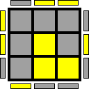 |
|  986/1296 | 1103242 | 100:00110:10101:10001:010 | 2 | 2 |  |
|  987/1296 | 1103250 | 100:00110:10101:10010:010 | 1 | 1 |  |
|  988/1296 | 1103265 | 100:00110:10101:10100:001 | 0 | 0 |  |
|  989/1296 | 1103272 | 100:00110:10101:10101:000 | 2 | 2 |  |
|  990/1296 | 1103280 | 100:00110:10101:10110:000 | 1 | 1 |  |
|  991/1296 | 1103367 | 100:00110:10110:00000:111 | 2 | 2 |  |
|  992/1296 | 1103374 | 100:00110:10110:00001:110 | 1 | 1 |  |
|  993/1296 | 1103382 | 100:00110:10110:00010:110 | 0 | 0 |  |
|  994/1296 | 1103397 | 100:00110:10110:00100:101 | 2 | 2 |  |
|  995/1296 | 1103404 | 100:00110:10110:00101:100 | 1 | 1 |  |
|  996/1296 | 1103412 | 100:00110:10110:00110:100 | 0 | 0 |  |
|  997/1296 | 1103427 | 100:00110:10110:01000:011 | 1 | 1 |  |
|  998/1296 | 1103434 | 100:00110:10110:01001:010 | 0 | 0 |  |
|  999/1296 | 1103442 | 100:00110:10110:01010:010 | 2 | 2 |  |
| 1000/1296 | 1103457 | 100:00110:10110:01100:001 | 1 | 1 |  |
| 1001/1296 | 1103464 | 100:00110:10110:01101:000 | 0 | 0 |  |
| 1002/1296 | 1103472 | 100:00110:10110:01110:000 | 2 | 2 | 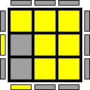 |
| 1003/1296 | 1103491 | 100:00110:10110:10000:011 | 0 | 0 | 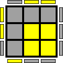 |
| 1004/1296 | 1103498 | 100:00110:10110:10001:010 | 2 | 2 |  |
| 1005/1296 | 1103506 | 100:00110:10110:10010:010 | 1 | 1 |  |
| 1006/1296 | 1103521 | 100:00110:10110:10100:001 | 0 | 0 |  |
| 1007/1296 | 1103528 | 100:00110:10110:10101:000 | 2 | 2 |  |
| 1008/1296 | 1103536 | 100:00110:10110:10110:000 | 1 | 1 |  |
| 1009/1296 | 1346823 | 101:00100:01101:00000:111 | 0 | 0 |  |
| 1010/1296 | 1346830 | 101:00100:01101:00001:110 | 2 | 2 |  |
| 1011/1296 | 1346838 | 101:00100:01101:00010:110 | 1 | 1 |  |
| 1012/1296 | 1346853 | 101:00100:01101:00100:101 | 0 | 0 |  |
| 1013/1296 | 1346860 | 101:00100:01101:00101:100 | 2 | 2 |  |
| 1014/1296 | 1346868 | 101:00100:01101:00110:100 | 1 | 1 |  |
| 1015/1296 | 1346883 | 101:00100:01101:01000:011 | 2 | 2 |  |
| 1016/1296 | 1346890 | 101:00100:01101:01001:010 | 1 | 1 |  |
| 1017/1296 | 1346898 | 101:00100:01101:01010:010 | 0 | 0 |  |
| 1018/1296 | 1346913 | 101:00100:01101:01100:001 | 2 | 2 |  |
| 1019/1296 | 1346920 | 101:00100:01101:01101:000 | 1 | 1 |  |
| 1020/1296 | 1346928 | 101:00100:01101:01110:000 | 0 | 0 |  |
| 1021/1296 | 1346947 | 101:00100:01101:10000:011 | 1 | 1 |  |
| 1022/1296 | 1346954 | 101:00100:01101:10001:010 | 0 | 0 |  |
| 1023/1296 | 1346962 | 101:00100:01101:10010:010 | 2 | 2 |  |
| 1024/1296 | 1346977 | 101:00100:01101:10100:001 | 1 | 1 |  |
| 1025/1296 | 1346984 | 101:00100:01101:10101:000 | 0 | 0 | 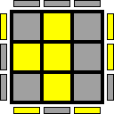 |
| 1026/1296 | 1346992 | 101:00100:01101:10110:000 | 2 | 2 |  |
| 1027/1296 | 1347079 | 101:00100:01110:00000:111 | 0 | 0 |  |
| 1028/1296 | 1347086 | 101:00100:01110:00001:110 | 2 | 2 |  |
| 1029/1296 | 1347094 | 101:00100:01110:00010:110 | 1 | 1 |  |
| 1030/1296 | 1347109 | 101:00100:01110:00100:101 | 0 | 0 |  |
| 1031/1296 | 1347116 | 101:00100:01110:00101:100 | 2 | 2 |  |
| 1032/1296 | 1347124 | 101:00100:01110:00110:100 | 1 | 1 |  |
| 1033/1296 | 1347139 | 101:00100:01110:01000:011 | 2 | 2 |  |
| 1034/1296 | 1347146 | 101:00100:01110:01001:010 | 1 | 1 |  |
| 1035/1296 | 1347154 | 101:00100:01110:01010:010 | 0 | 0 |  |
| 1036/1296 | 1347169 | 101:00100:01110:01100:001 | 2 | 2 |  |
| 1037/1296 | 1347176 | 101:00100:01110:01101:000 | 1 | 1 |  |
| 1038/1296 | 1347184 | 101:00100:01110:01110:000 | 0 | 0 |  |
| 1039/1296 | 1347203 | 101:00100:01110:10000:011 | 1 | 1 |  |
| 1040/1296 | 1347210 | 101:00100:01110:10001:010 | 0 | 0 | 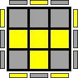 |
| 1041/1296 | 1347218 | 101:00100:01110:10010:010 | 2 | 2 |  |
| 1042/1296 | 1347233 | 101:00100:01110:10100:001 | 1 | 1 |  |
| 1043/1296 | 1347240 | 101:00100:01110:10101:000 | 0 | 0 |  |
| 1044/1296 | 1347248 | 101:00100:01110:10110:000 | 2 | 2 |  |
| 1045/1296 | 1348871 | 101:00100:10101:00000:111 | 0 | 0 |  |
| 1046/1296 | 1348878 | 101:00100:10101:00001:110 | 2 | 2 |  |
| 1047/1296 | 1348886 | 101:00100:10101:00010:110 | 1 | 1 |  |
| 1048/1296 | 1348901 | 101:00100:10101:00100:101 | 0 | 0 |  |
| 1049/1296 | 1348908 | 101:00100:10101:00101:100 | 2 | 2 |  |
| 1050/1296 | 1348916 | 101:00100:10101:00110:100 | 1 | 1 |  |
| 1051/1296 | 1348931 | 101:00100:10101:01000:011 | 2 | 2 |  |
| 1052/1296 | 1348938 | 101:00100:10101:01001:010 | 1 | 1 |  |
| 1053/1296 | 1348946 | 101:00100:10101:01010:010 | 0 | 0 |  |
| 1054/1296 | 1348961 | 101:00100:10101:01100:001 | 2 | 2 |  |
| 1055/1296 | 1348968 | 101:00100:10101:01101:000 | 1 | 1 | 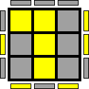 |
| 1056/1296 | 1348976 | 101:00100:10101:01110:000 | 0 | 0 | 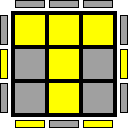 |
| 1057/1296 | 1348995 | 101:00100:10101:10000:011 | 1 | 1 |  |
| 1058/1296 | 1349002 | 101:00100:10101:10001:010 | 0 | 0 |  |
| 1059/1296 | 1349010 | 101:00100:10101:10010:010 | 2 | 2 |  |
| 1060/1296 | 1349025 | 101:00100:10101:10100:001 | 1 | 1 |  |
| 1061/1296 | 1349032 | 101:00100:10101:10101:000 | 0 | 0 |  |
| 1062/1296 | 1349040 | 101:00100:10101:10110:000 | 2 | 2 |  |
| 1063/1296 | 1349127 | 101:00100:10110:00000:111 | 0 | 0 |  |
| 1064/1296 | 1349134 | 101:00100:10110:00001:110 | 2 | 2 |  |
| 1065/1296 | 1349142 | 101:00100:10110:00010:110 | 1 | 1 |  |
| 1066/1296 | 1349157 | 101:00100:10110:00100:101 | 0 | 0 |  |
| 1067/1296 | 1349164 | 101:00100:10110:00101:100 | 2 | 2 |  |
| 1068/1296 | 1349172 | 101:00100:10110:00110:100 | 1 | 1 |  |
| 1069/1296 | 1349187 | 101:00100:10110:01000:011 | 2 | 2 |  |
| 1070/1296 | 1349194 | 101:00100:10110:01001:010 | 1 | 1 |  |
| 1071/1296 | 1349202 | 101:00100:10110:01010:010 | 0 | 0 |  |
| 1072/1296 | 1349217 | 101:00100:10110:01100:001 | 2 | 2 |  |
| 1073/1296 | 1349224 | 101:00100:10110:01101:000 | 1 | 1 |  |
| 1074/1296 | 1349232 | 101:00100:10110:01110:000 | 0 | 0 |  |
| 1075/1296 | 1349251 | 101:00100:10110:10000:011 | 1 | 1 |  |
| 1076/1296 | 1349258 | 101:00100:10110:10001:010 | 0 | 0 |  |
| 1077/1296 | 1349266 | 101:00100:10110:10010:010 | 2 | 2 |  |
| 1078/1296 | 1349281 | 101:00100:10110:10100:001 | 1 | 1 |  |
| 1079/1296 | 1349288 | 101:00100:10110:10101:000 | 0 | 0 |  |
| 1080/1296 | 1349296 | 101:00100:10110:10110:000 | 2 | 2 |  |
| 1081/1296 | 1584391 | 110:00001:01101:00000:111 | 1 | 1 | 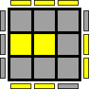 |
| 1082/1296 | 1584398 | 110:00001:01101:00001:110 | 0 | 0 |  |
| 1083/1296 | 1584406 | 110:00001:01101:00010:110 | 2 | 2 |  |
| 1084/1296 | 1584421 | 110:00001:01101:00100:101 | 1 | 1 |  |
| 1085/1296 | 1584428 | 110:00001:01101:00101:100 | 0 | 0 |  |
| 1086/1296 | 1584436 | 110:00001:01101:00110:100 | 2 | 2 |  |
| 1087/1296 | 1584451 | 110:00001:01101:01000:011 | 0 | 0 |  |
| 1088/1296 | 1584458 | 110:00001:01101:01001:010 | 2 | 2 |  |
| 1089/1296 | 1584466 | 110:00001:01101:01010:010 | 1 | 1 |  |
| 1090/1296 | 1584481 | 110:00001:01101:01100:001 | 0 | 0 |  |
| 1091/1296 | 1584488 | 110:00001:01101:01101:000 | 2 | 2 |  |
| 1092/1296 | 1584496 | 110:00001:01101:01110:000 | 1 | 1 |  |
| 1093/1296 | 1584515 | 110:00001:01101:10000:011 | 2 | 2 |  |
| 1094/1296 | 1584522 | 110:00001:01101:10001:010 | 1 | 1 |  |
| 1095/1296 | 1584530 | 110:00001:01101:10010:010 | 0 | 0 |  |
| 1096/1296 | 1584545 | 110:00001:01101:10100:001 | 2 | 2 |  |
| 1097/1296 | 1584552 | 110:00001:01101:10101:000 | 1 | 1 |  |
| 1098/1296 | 1584560 | 110:00001:01101:10110:000 | 0 | 0 |  |
| 1099/1296 | 1584647 | 110:00001:01110:00000:111 | 1 | 1 |  |
| 1100/1296 | 1584654 | 110:00001:01110:00001:110 | 0 | 0 |  |
| 1101/1296 | 1584662 | 110:00001:01110:00010:110 | 2 | 2 |  |
| 1102/1296 | 1584677 | 110:00001:01110:00100:101 | 1 | 1 | 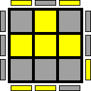 |
| 1103/1296 | 1584684 | 110:00001:01110:00101:100 | 0 | 0 |  |
| 1104/1296 | 1584692 | 110:00001:01110:00110:100 | 2 | 2 |  |
| 1105/1296 | 1584707 | 110:00001:01110:01000:011 | 0 | 0 |  |
| 1106/1296 | 1584714 | 110:00001:01110:01001:010 | 2 | 2 |  |
| 1107/1296 | 1584722 | 110:00001:01110:01010:010 | 1 | 1 |  |
| 1108/1296 | 1584737 | 110:00001:01110:01100:001 | 0 | 0 |  |
| 1109/1296 | 1584744 | 110:00001:01110:01101:000 | 2 | 2 |  |
| 1110/1296 | 1584752 | 110:00001:01110:01110:000 | 1 | 1 |  |
| 1111/1296 | 1584771 | 110:00001:01110:10000:011 | 2 | 2 |  |
| 1112/1296 | 1584778 | 110:00001:01110:10001:010 | 1 | 1 |  |
| 1113/1296 | 1584786 | 110:00001:01110:10010:010 | 0 | 0 |  |
| 1114/1296 | 1584801 | 110:00001:01110:10100:001 | 2 | 2 |  |
| 1115/1296 | 1584808 | 110:00001:01110:10101:000 | 1 | 1 |  |
| 1116/1296 | 1584816 | 110:00001:01110:10110:000 | 0 | 0 |  |
| 1117/1296 | 1586439 | 110:00001:10101:00000:111 | 1 | 1 |  |
| 1118/1296 | 1586446 | 110:00001:10101:00001:110 | 0 | 0 |  |
| 1119/1296 | 1586454 | 110:00001:10101:00010:110 | 2 | 2 |  |
| 1120/1296 | 1586469 | 110:00001:10101:00100:101 | 1 | 1 |  |
| 1121/1296 | 1586476 | 110:00001:10101:00101:100 | 0 | 0 |  |
| 1122/1296 | 1586484 | 110:00001:10101:00110:100 | 2 | 2 |  |
| 1123/1296 | 1586499 | 110:00001:10101:01000:011 | 0 | 0 |  |
| 1124/1296 | 1586506 | 110:00001:10101:01001:010 | 2 | 2 |  |
| 1125/1296 | 1586514 | 110:00001:10101:01010:010 | 1 | 1 |  |
| 1126/1296 | 1586529 | 110:00001:10101:01100:001 | 0 | 0 |  |
| 1127/1296 | 1586536 | 110:00001:10101:01101:000 | 2 | 2 |  |
| 1128/1296 | 1586544 | 110:00001:10101:01110:000 | 1 | 1 |  |
| 1129/1296 | 1586563 | 110:00001:10101:10000:011 | 2 | 2 |  |
| 1130/1296 | 1586570 | 110:00001:10101:10001:010 | 1 | 1 |  |
| 1131/1296 | 1586578 | 110:00001:10101:10010:010 | 0 | 0 |  |
| 1132/1296 | 1586593 | 110:00001:10101:10100:001 | 2 | 2 |  |
| 1133/1296 | 1586600 | 110:00001:10101:10101:000 | 1 | 1 |  |
| 1134/1296 | 1586608 | 110:00001:10101:10110:000 | 0 | 0 |  |
| 1135/1296 | 1586695 | 110:00001:10110:00000:111 | 1 | 1 |  |
| 1136/1296 | 1586702 | 110:00001:10110:00001:110 | 0 | 0 |  |
| 1137/1296 | 1586710 | 110:00001:10110:00010:110 | 2 | 2 |  |
| 1138/1296 | 1586725 | 110:00001:10110:00100:101 | 1 | 1 |  |
| 1139/1296 | 1586732 | 110:00001:10110:00101:100 | 0 | 0 |  |
| 1140/1296 | 1586740 | 110:00001:10110:00110:100 | 2 | 2 |  |
| 1141/1296 | 1586755 | 110:00001:10110:01000:011 | 0 | 0 |  |
| 1142/1296 | 1586762 | 110:00001:10110:01001:010 | 2 | 2 |  |
| 1143/1296 | 1586770 | 110:00001:10110:01010:010 | 1 | 1 |  |
| 1144/1296 | 1586785 | 110:00001:10110:01100:001 | 0 | 0 |  |
| 1145/1296 | 1586792 | 110:00001:10110:01101:000 | 2 | 2 |  |
| 1146/1296 | 1586800 | 110:00001:10110:01110:000 | 1 | 1 |  |
| 1147/1296 | 1586819 | 110:00001:10110:10000:011 | 2 | 2 |  |
| 1148/1296 | 1586826 | 110:00001:10110:10001:010 | 1 | 1 |  |
| 1149/1296 | 1586834 | 110:00001:10110:10010:010 | 0 | 0 |  |
| 1150/1296 | 1586849 | 110:00001:10110:10100:001 | 2 | 2 |  |
| 1151/1296 | 1586856 | 110:00001:10110:10101:000 | 1 | 1 |  |
| 1152/1296 | 1586864 | 110:00001:10110:10110:000 | 0 | 0 |  |
| 1153/1296 | 1592583 | 110:00010:01101:00000:111 | 2 | 2 |  |
| 1154/1296 | 1592590 | 110:00010:01101:00001:110 | 1 | 1 |  |
| 1155/1296 | 1592598 | 110:00010:01101:00010:110 | 0 | 0 |  |
| 1156/1296 | 1592613 | 110:00010:01101:00100:101 | 2 | 2 |  |
| 1157/1296 | 1592620 | 110:00010:01101:00101:100 | 1 | 1 |  |
| 1158/1296 | 1592628 | 110:00010:01101:00110:100 | 0 | 0 |  |
| 1159/1296 | 1592643 | 110:00010:01101:01000:011 | 1 | 1 |  |
| 1160/1296 | 1592650 | 110:00010:01101:01001:010 | 0 | 0 |  |
| 1161/1296 | 1592658 | 110:00010:01101:01010:010 | 2 | 2 |  |
| 1162/1296 | 1592673 | 110:00010:01101:01100:001 | 1 | 1 |  |
| 1163/1296 | 1592680 | 110:00010:01101:01101:000 | 0 | 0 |  |
| 1164/1296 | 1592688 | 110:00010:01101:01110:000 | 2 | 2 |  |
| 1165/1296 | 1592707 | 110:00010:01101:10000:011 | 0 | 0 |  |
| 1166/1296 | 1592714 | 110:00010:01101:10001:010 | 2 | 2 |  |
| 1167/1296 | 1592722 | 110:00010:01101:10010:010 | 1 | 1 |  |
| 1168/1296 | 1592737 | 110:00010:01101:10100:001 | 0 | 0 |  |
| 1169/1296 | 1592744 | 110:00010:01101:10101:000 | 2 | 2 |  |
| 1170/1296 | 1592752 | 110:00010:01101:10110:000 | 1 | 1 |  |
| 1171/1296 | 1592839 | 110:00010:01110:00000:111 | 2 | 2 |  |
| 1172/1296 | 1592846 | 110:00010:01110:00001:110 | 1 | 1 |  |
| 1173/1296 | 1592854 | 110:00010:01110:00010:110 | 0 | 0 |  |
| 1174/1296 | 1592869 | 110:00010:01110:00100:101 | 2 | 2 |  |
| 1175/1296 | 1592876 | 110:00010:01110:00101:100 | 1 | 1 |  |
| 1176/1296 | 1592884 | 110:00010:01110:00110:100 | 0 | 0 |  |
| 1177/1296 | 1592899 | 110:00010:01110:01000:011 | 1 | 1 |  |
| 1178/1296 | 1592906 | 110:00010:01110:01001:010 | 0 | 0 |  |
| 1179/1296 | 1592914 | 110:00010:01110:01010:010 | 2 | 2 |  |
| 1180/1296 | 1592929 | 110:00010:01110:01100:001 | 1 | 1 |  |
| 1181/1296 | 1592936 | 110:00010:01110:01101:000 | 0 | 0 |  |
| 1182/1296 | 1592944 | 110:00010:01110:01110:000 | 2 | 2 |  |
| 1183/1296 | 1592963 | 110:00010:01110:10000:011 | 0 | 0 |  |
| 1184/1296 | 1592970 | 110:00010:01110:10001:010 | 2 | 2 |  |
| 1185/1296 | 1592978 | 110:00010:01110:10010:010 | 1 | 1 |  |
| 1186/1296 | 1592993 | 110:00010:01110:10100:001 | 0 | 0 |  |
| 1187/1296 | 1593000 | 110:00010:01110:10101:000 | 2 | 2 |  |
| 1188/1296 | 1593008 | 110:00010:01110:10110:000 | 1 | 1 |  |
| 1189/1296 | 1594631 | 110:00010:10101:00000:111 | 2 | 2 |  |
| 1190/1296 | 1594638 | 110:00010:10101:00001:110 | 1 | 1 |  |
| 1191/1296 | 1594646 | 110:00010:10101:00010:110 | 0 | 0 |  |
| 1192/1296 | 1594661 | 110:00010:10101:00100:101 | 2 | 2 |  |
| 1193/1296 | 1594668 | 110:00010:10101:00101:100 | 1 | 1 |  |
| 1194/1296 | 1594676 | 110:00010:10101:00110:100 | 0 | 0 |  |
| 1195/1296 | 1594691 | 110:00010:10101:01000:011 | 1 | 1 |  |
| 1196/1296 | 1594698 | 110:00010:10101:01001:010 | 0 | 0 |  |
| 1197/1296 | 1594706 | 110:00010:10101:01010:010 | 2 | 2 |  |
| 1198/1296 | 1594721 | 110:00010:10101:01100:001 | 1 | 1 |  |
| 1199/1296 | 1594728 | 110:00010:10101:01101:000 | 0 | 0 |  |
| 1200/1296 | 1594736 | 110:00010:10101:01110:000 | 2 | 2 |  |
| 1201/1296 | 1594755 | 110:00010:10101:10000:011 | 0 | 0 |  |
| 1202/1296 | 1594762 | 110:00010:10101:10001:010 | 2 | 2 |  |
| 1203/1296 | 1594770 | 110:00010:10101:10010:010 | 1 | 1 |  |
| 1204/1296 | 1594785 | 110:00010:10101:10100:001 | 0 | 0 |  |
| 1205/1296 | 1594792 | 110:00010:10101:10101:000 | 2 | 2 |  |
| 1206/1296 | 1594800 | 110:00010:10101:10110:000 | 1 | 1 |  |
| 1207/1296 | 1594887 | 110:00010:10110:00000:111 | 2 | 2 |  |
| 1208/1296 | 1594894 | 110:00010:10110:00001:110 | 1 | 1 |  |
| 1209/1296 | 1594902 | 110:00010:10110:00010:110 | 0 | 0 |  |
| 1210/1296 | 1594917 | 110:00010:10110:00100:101 | 2 | 2 |  |
| 1211/1296 | 1594924 | 110:00010:10110:00101:100 | 1 | 1 |  |
| 1212/1296 | 1594932 | 110:00010:10110:00110:100 | 0 | 0 |  |
| 1213/1296 | 1594947 | 110:00010:10110:01000:011 | 1 | 1 |  |
| 1214/1296 | 1594954 | 110:00010:10110:01001:010 | 0 | 0 |  |
| 1215/1296 | 1594962 | 110:00010:10110:01010:010 | 2 | 2 |  |
| 1216/1296 | 1594977 | 110:00010:10110:01100:001 | 1 | 1 |  |
| 1217/1296 | 1594984 | 110:00010:10110:01101:000 | 0 | 0 |  |
| 1218/1296 | 1594992 | 110:00010:10110:01110:000 | 2 | 2 | 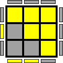 |
| 1219/1296 | 1595011 | 110:00010:10110:10000:011 | 0 | 0 |  |
| 1220/1296 | 1595018 | 110:00010:10110:10001:010 | 2 | 2 |  |
| 1221/1296 | 1595026 | 110:00010:10110:10010:010 | 1 | 1 |  |
| 1222/1296 | 1595041 | 110:00010:10110:10100:001 | 0 | 0 |  |
| 1223/1296 | 1595048 | 110:00010:10110:10101:000 | 2 | 2 |  |
| 1224/1296 | 1595056 | 110:00010:10110:10110:000 | 1 | 1 |  |
| 1225/1296 | 1838343 | 111:00000:01101:00000:111 | 0 | 0 |  |
| 1226/1296 | 1838350 | 111:00000:01101:00001:110 | 2 | 2 |  |
| 1227/1296 | 1838358 | 111:00000:01101:00010:110 | 1 | 1 |  |
| 1228/1296 | 1838373 | 111:00000:01101:00100:101 | 0 | 0 |  |
| 1229/1296 | 1838380 | 111:00000:01101:00101:100 | 2 | 2 |  |
| 1230/1296 | 1838388 | 111:00000:01101:00110:100 | 1 | 1 |  |
| 1231/1296 | 1838403 | 111:00000:01101:01000:011 | 2 | 2 |  |
| 1232/1296 | 1838410 | 111:00000:01101:01001:010 | 1 | 1 |  |
| 1233/1296 | 1838418 | 111:00000:01101:01010:010 | 0 | 0 |  |
| 1234/1296 | 1838433 | 111:00000:01101:01100:001 | 2 | 2 |  |
| 1235/1296 | 1838440 | 111:00000:01101:01101:000 | 1 | 1 |  |
| 1236/1296 | 1838448 | 111:00000:01101:01110:000 | 0 | 0 |  |
| 1237/1296 | 1838467 | 111:00000:01101:10000:011 | 1 | 1 |  |
| 1238/1296 | 1838474 | 111:00000:01101:10001:010 | 0 | 0 |  |
| 1239/1296 | 1838482 | 111:00000:01101:10010:010 | 2 | 2 |  |
| 1240/1296 | 1838497 | 111:00000:01101:10100:001 | 1 | 1 | 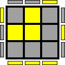 |
| 1241/1296 | 1838504 | 111:00000:01101:10101:000 | 0 | 0 |  |
| 1242/1296 | 1838512 | 111:00000:01101:10110:000 | 2 | 2 |  |
| 1243/1296 | 1838599 | 111:00000:01110:00000:111 | 0 | 0 |  |
| 1244/1296 | 1838606 | 111:00000:01110:00001:110 | 2 | 2 |  |
| 1245/1296 | 1838614 | 111:00000:01110:00010:110 | 1 | 1 |  |
| 1246/1296 | 1838629 | 111:00000:01110:00100:101 | 0 | 0 |  |
| 1247/1296 | 1838636 | 111:00000:01110:00101:100 | 2 | 2 |  |
| 1248/1296 | 1838644 | 111:00000:01110:00110:100 | 1 | 1 |  |
| 1249/1296 | 1838659 | 111:00000:01110:01000:011 | 2 | 2 |  |
| 1250/1296 | 1838666 | 111:00000:01110:01001:010 | 1 | 1 |  |
| 1251/1296 | 1838674 | 111:00000:01110:01010:010 | 0 | 0 |  |
| 1252/1296 | 1838689 | 111:00000:01110:01100:001 | 2 | 2 |  |
| 1253/1296 | 1838696 | 111:00000:01110:01101:000 | 1 | 1 |  |
| 1254/1296 | 1838704 | 111:00000:01110:01110:000 | 0 | 0 | 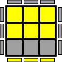 |
| 1255/1296 | 1838723 | 111:00000:01110:10000:011 | 1 | 1 |  |
| 1256/1296 | 1838730 | 111:00000:01110:10001:010 | 0 | 0 |  |
| 1257/1296 | 1838738 | 111:00000:01110:10010:010 | 2 | 2 |  |
| 1258/1296 | 1838753 | 111:00000:01110:10100:001 | 1 | 1 |  |
| 1259/1296 | 1838760 | 111:00000:01110:10101:000 | 0 | 0 |  |
| 1260/1296 | 1838768 | 111:00000:01110:10110:000 | 2 | 2 |  |
| 1261/1296 | 1840391 | 111:00000:10101:00000:111 | 0 | 0 |  |
| 1262/1296 | 1840398 | 111:00000:10101:00001:110 | 2 | 2 |  |
| 1263/1296 | 1840406 | 111:00000:10101:00010:110 | 1 | 1 |  |
| 1264/1296 | 1840421 | 111:00000:10101:00100:101 | 0 | 0 |  |
| 1265/1296 | 1840428 | 111:00000:10101:00101:100 | 2 | 2 |  |
| 1266/1296 | 1840436 | 111:00000:10101:00110:100 | 1 | 1 | 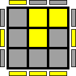 |
| 1267/1296 | 1840451 | 111:00000:10101:01000:011 | 2 | 2 |  |
| 1268/1296 | 1840458 | 111:00000:10101:01001:010 | 1 | 1 |  |
| 1269/1296 | 1840466 | 111:00000:10101:01010:010 | 0 | 0 |  |
| 1270/1296 | 1840481 | 111:00000:10101:01100:001 | 2 | 2 |  |
| 1271/1296 | 1840488 | 111:00000:10101:01101:000 | 1 | 1 |  |
| 1272/1296 | 1840496 | 111:00000:10101:01110:000 | 0 | 0 |  |
| 1273/1296 | 1840515 | 111:00000:10101:10000:011 | 1 | 1 |  |
| 1274/1296 | 1840522 | 111:00000:10101:10001:010 | 0 | 0 |  |
| 1275/1296 | 1840530 | 111:00000:10101:10010:010 | 2 | 2 |  |
| 1276/1296 | 1840545 | 111:00000:10101:10100:001 | 1 | 1 |  |
| 1277/1296 | 1840552 | 111:00000:10101:10101:000 | 0 | 0 |  |
| 1278/1296 | 1840560 | 111:00000:10101:10110:000 | 2 | 2 |  |
| 1279/1296 | 1840647 | 111:00000:10110:00000:111 | 0 | 0 |  |
| 1280/1296 | 1840654 | 111:00000:10110:00001:110 | 2 | 2 |  |
| 1281/1296 | 1840662 | 111:00000:10110:00010:110 | 1 | 1 |  |
| 1282/1296 | 1840677 | 111:00000:10110:00100:101 | 0 | 0 |  |
| 1283/1296 | 1840684 | 111:00000:10110:00101:100 | 2 | 2 |  |
| 1284/1296 | 1840692 | 111:00000:10110:00110:100 | 1 | 1 |  |
| 1285/1296 | 1840707 | 111:00000:10110:01000:011 | 2 | 2 |  |
| 1286/1296 | 1840714 | 111:00000:10110:01001:010 | 1 | 1 |  |
| 1287/1296 | 1840722 | 111:00000:10110:01010:010 | 0 | 0 |  |
| 1288/1296 | 1840737 | 111:00000:10110:01100:001 | 2 | 2 |  |
| 1289/1296 | 1840744 | 111:00000:10110:01101:000 | 1 | 1 |  |
| 1290/1296 | 1840752 | 111:00000:10110:01110:000 | 0 | 0 |  |
| 1291/1296 | 1840771 | 111:00000:10110:10000:011 | 1 | 1 |  |
| 1292/1296 | 1840778 | 111:00000:10110:10001:010 | 0 | 0 |  |
| 1293/1296 | 1840786 | 111:00000:10110:10010:010 | 2 | 2 |  |
| 1294/1296 | 1840801 | 111:00000:10110:10100:001 | 1 | 1 |  |
| 1295/1296 | 1840808 | 111:00000:10110:10101:000 | 0 | 0 | 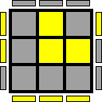 |
| 1296/1296 | 1840816 | 111:00000:10110:10110:000 | 2 | 2 |  |

